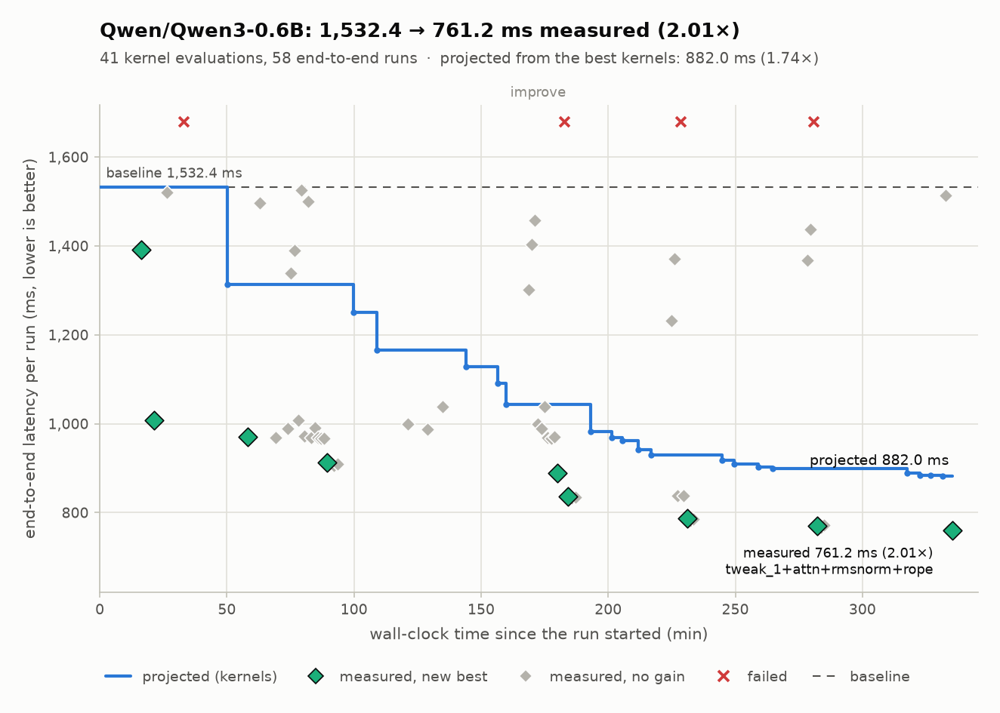
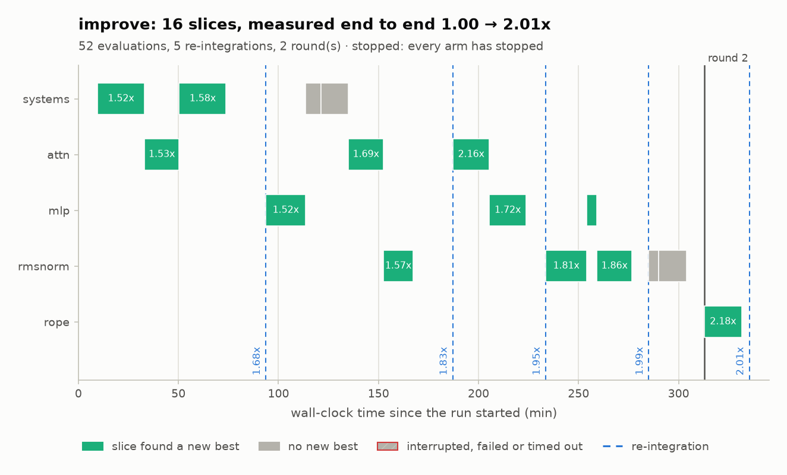
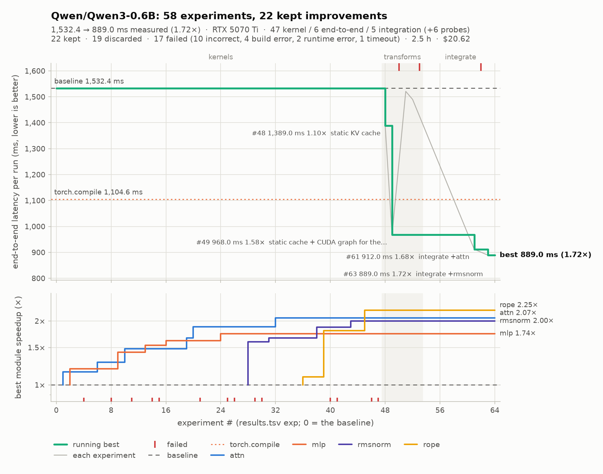
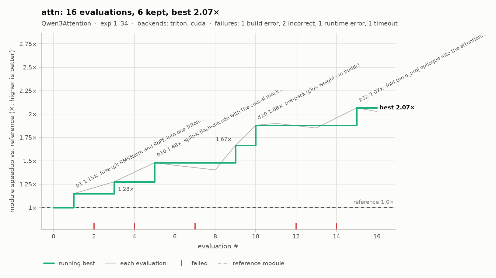
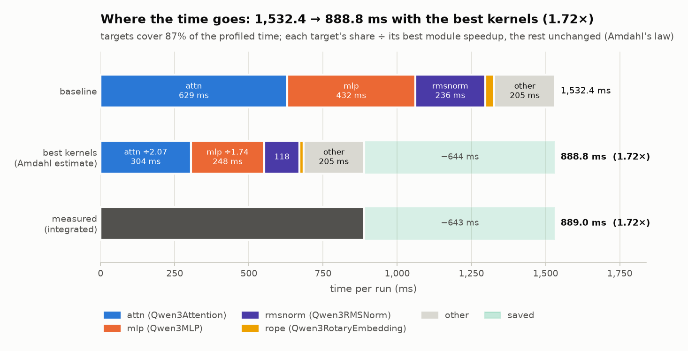
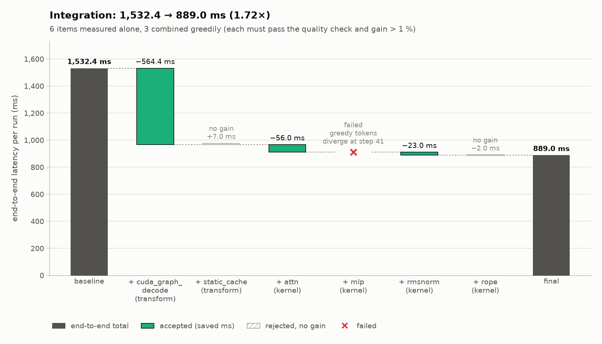
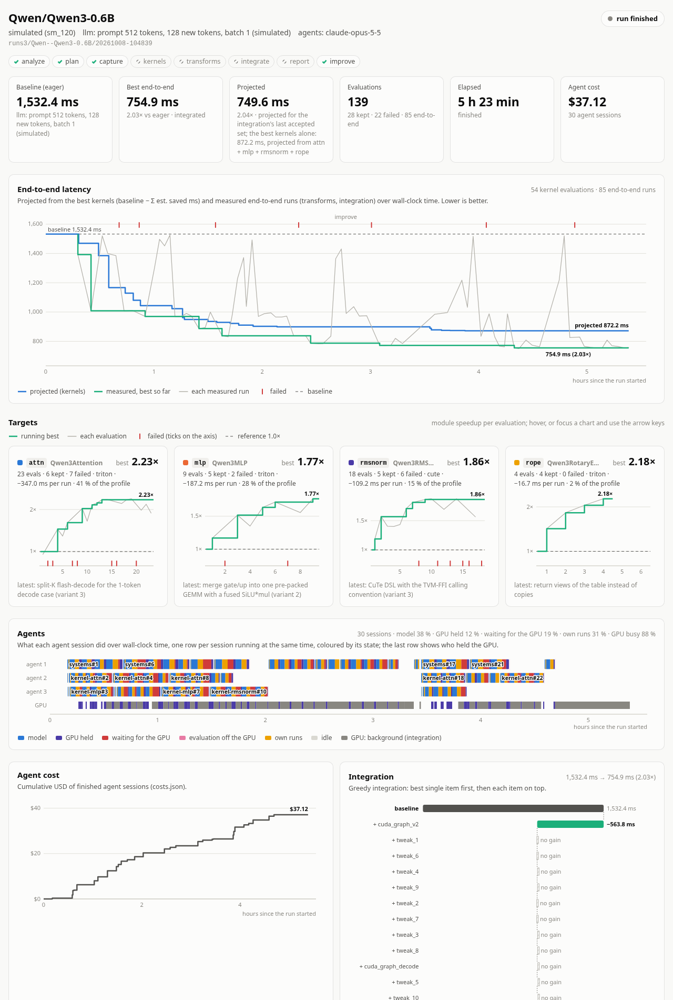

# kernel-agent

Give it a Hugging Face URL; it profiles the model on your GPU, finds the slow
parts, and has Claude write custom GPU kernels for them in **CUDA C++,
CuTe DSL, Triton or TileLang**. It also tries model-level algorithm changes
(static caches, CUDA graphs, merged projections). Each candidate is checked
for correctness against real captured inputs, benchmarked, and kept only if
the whole model still produces the same output and runs faster.

Works on **LLM**, **STT**, **TTS** and **diffusion** models, plus a built-in
workload for **VoxCPM2** (diffusion-autoregressive TTS). When no built-in
workload can run a model (custom TTS stacks, for example), Claude writes a
benchmark harness for it first.

```bash
uv sync --extra all
uv run kernel-agent doctor --smoke      # check GPU, compilers, all 5 backends
uv run kernel-agent optimize https://huggingface.co/Qwen/Qwen3-0.6B
```

## How it works

```
HF URL ─► resolve (modality, arch, family, size)
        ─► analyze   load model, baseline latency, determinism check,
                     sensitivity probe, teacher-forcing self-check,
                     module-level + kernel-level profile           [GPU worker]
        ─► (harness) Claude writes harness.py if the built-in workload fails
        ─► plan      Claude reads the profile + source, picks target modules,
                     an approach and backends for each, and model transforms
        ─► capture   each target module is saved with real inputs/outputs
                     (prefill + decode shapes, KV-cache side effects, every
                     entrypoint such as forward_step)               [GPU worker]
        ─► kernels   one Claude "kernel engineer" per target writes candidates,
                     calls evaluate_candidate (correctness + interleaved
                     benchmark + optional per-kernel profile) and iterates
        ─► transforms  Claude "systems engineer" writes model-level transforms,
                     validated end to end with evaluate_e2e
        ─► integrate all winners are applied together, validated against the
                     baseline output; greedy fallback if the combination fails
        ─► report    report.md + optimized/ (kernels + apply.py)
```

All GPU work runs in subprocesses under a GPU lock, so a crashing kernel or an
illegal memory access can't kill the run, and parallel agents
(`--parallel N`) never benchmark at the same time.

### What "correct" means

* **Module level** (`evaluate_candidate`): every captured case must match the
  reference outputs **and** the in-place side effects (for example KV-cache
  appends) within dtype-aware tolerances (bf16 2e-2, fp16 1e-2, fp32 1e-4;
  at most 0.1 % of elements outside). Side effects are compared on the
  elements the reference or the candidate changed, so writing one position of
  an 8192-long cache (or forgetting to) is not lost in the 0.1 %. If `build()`
  hands back the reference module unchanged, the candidate is rejected.
* **Model level** (`e2e`): the workload's own comparison. For LLM/STT that is
  identical greedy tokens for the first N tokens plus first-step logits cosine
  ≥ 0.99. For TTS it is spectral cosine. For diffusion it is PSNR ≥ 25 dB on
  the same seed. Timing is always the free-running workload.
* **Chaotic workloads** (teacher forcing): in an autoregressive model with
  continuous, sampled outputs (VoxCPM: LM → flow-matching head with fresh noise
  → latent fed back), any numerically-correct kernel makes the free-running
  output diverge. The bundled Triton RMSNorm gives spectral cosine 0.69 on
  VoxCPM2, a different seed 0.37. Such workloads implement
  `run_teacher_forced`: the candidate replays the baseline trajectory with the
  same per-step noise, and its own prediction for every step is compared with
  the baseline's (per-step cosine, mean and minimum, plus an RMS ratio). The
  free-running output only has to pass a sanity check: finite, same shapes, RMS
  energy within ±25 % (VoxCPM: ±60 % for audio). The full free-running
  comparison is reported as `metrics.free_running` and does not gate.
  Teacher-forced metrics are in `metrics.teacher_forced`.
* **Sensitivity probe**: `analyze` runs the workload once more with every
  `nn.Linear` output multiplied by `1 ± 2^-8` (about one bf16 rounding step) and
  records whether the free-running comparison still passes
  (`baseline.json` → `sensitivity`, and `profile/summary.md`). If it fails, the
  workload counts as chaotic. If it also has no teacher forcing, a loud warning
  says that end-to-end validation will reject (almost) every kernel.
  Teacher-forced workloads also replay their own trajectory once, which must be
  exact (`baseline.json` → `teacher_forcing`).

### What "faster" means

Reference and candidate are timed in alternating rounds with CUDA events
after a GPU warm-up, and the median round is reported. Mutable inputs (caches)
are deep-copied outside the timed region. A module's speedup is weighted by how
often each captured shape runs per inference. The end-to-end speedup is
wall-clock latency of the whole workload.

### Entrypoints other than `forward`

Custom decode loops often call module methods directly, e.g. VoxCPM's
`MiniCPMModel.forward_step → MiniCPMDecoderLayer.forward_step →
MiniCPMAttention.forward_step`. Those calls bypass `nn.Module` hooks, so
kernel-agent finds them by name (`forward*`, `step`, `decode*`, `prefill*`,
`generate_step` defined on the model's own classes; add others with
`-o entrypoints=Cls.method,...` or `Workload.entrypoints`) and wraps them per
instance:

* the profile shows a *methods* column (`forward_step×720 (638.4 ms) ·
  forward×2448 (1208.7 ms)`) and signatures like `forward_step: a0[1, 2048]`;
* capture records cases from every entrypoint (`"method": "forward_step"`),
  keeping at least one case per entrypoint (`--max-cases`, default 4);
* the evaluator replays each case through its method (`candidate.forward_step(...)`)
  for correctness and timing; a candidate without a captured method is a
  `build_error`, and integration refuses a replacement that lacks one.

Arguments that are views into a much larger storage (one layer's K/V slice of
a static `[2, layers, B, H, T, D]` cache) are captured compactly: only the
memory the views span, with the same shapes, strides and aliasing between
overlapping views (a full deep copy would store the whole cache for every
case, before and after the call). Side effects are therefore checked on the
memory the arguments cover, not on the rest of the buffer they were sliced from.

### Speed of light

Every timed `evaluate_candidate` result says how close each case is to the
hardware limit (`kernel_agent/kernels/roofline.py`).

* **Peaks** are measured on the GPU once per GPU model and torch version, in a
  subprocess under the GPU lock (never inside a timed evaluation), and cached
  in `~/.cache/kernel-agent/peaks-<gpu>-torch<version>.json`. They are copy
  bandwidth from DRAM (512 MiB buffers) and from L2 (counting bytes read plus
  bytes written), dense matmul TFLOP/s for bf16, fp16 and fp32 (best of a few
  large shapes, TF32 off), and the launch floor (a module call that launches
  one tiny kernel, timed like a candidate). `kernel-agent doctor` measures and
  prints them (`--remeasure-peaks` measures again). `toolchain.json` and the
  agents' prompts include them. On the RTX 5070 Ti: copy DRAM 767 GB/s, L2
  2970 GB/s, matmul bf16/fp16/fp32 99 / 94 / 34 TFLOP/s, launch floor ~16 µs.
* **Work** is counted on the reference call. FLOPs come from
  `torch.utils.flop_counter.FlopCounterMode`, split by the dtype of each op's
  inputs. Attention (SDPA) FLOPs count only the query/key pairs that the mask
  or `is_causal` allows. `min_bytes` counts every byte range of the inputs,
  parameters and buffers that the reference reads, each one once. Unused
  weights, intermediates and metadata-only uses do not count. Gather ops
  (embedding, index) count only the rows they read, and SDPA counts only the
  key/value positions that some query attends to. Outputs and new state (for
  example a concatenated cache) count once. Inputs updated in place count only
  the elements that changed, so a decode step over a static KV cache costs the
  slot it writes plus the valid positions, not the whole cache.
* Per case: `flops`, `min_bytes`, `sol_ms = max(Σ flops / peak, min_bytes /
  bandwidth)`, `pct_of_sol = 100 × sol_ms / new_ms` and `bound`. `bound` is
  `compute`, `memory`, or `launch` when `sol_ms` is below the launch floor
  (one launch from Python costs more than the work). Cases whose bytes fit in
  L2 are compared with the L2 bandwidth (`l2_resident`), because the benchmark
  reuses the same inputs and runs them with a warm cache. The result also has
  the weighted `pct_of_sol` (cases weighted by calls per run), `sol_ms_weighted`,
  the dominant `bound` and `launch_floor_ms`.
* `new_ms < 0.9 × sol_ms` is faster than the hardware allows. That case and the
  result get `suspicious_faster_than_sol`, which is a warning and not a
  rejection. If the reference itself beats 0.9 × `sol_ms`, the estimate is wrong
  and the case gets `sol_unreliable` instead.
* Limitations: the bytes are what the reference touches. Masked work that
  happens outside SDPA (for example a `repeat_kv` copy of a whole static cache)
  counts in full, so a kernel that skips it can legitimately beat the estimate.
  Such a result is flagged, never rejected. Strided views count their whole
  span. Element-wise math counts as free. The launch floor is measured for a
  torch op, and backend launch paths add their own overhead on top of it
  (CUDA C++ ~19 µs, Triton ~43 µs, see Backends).

### Budgets

All limits are off by default (`kernel_agent/budget.py`).

* `--max-hours` / `--max-usd` cover the whole run. Before each kernel or
  transform agent starts, the elapsed time and the sum of `costs.json` are
  checked. Once the budget is spent, the remaining agents are skipped, but
  integrate and report always run on whatever results exist. 15 % of
  `--max-hours` (`--budget-reserve`) is kept for them. Each agent's own USD cap
  (`--budget`) is lowered to what is left of `--max-usd`. Time counts from the
  start of the current `optimize`/`resume` process; USD counts the whole run.
* `--agent-minutes` stops an agent session after that many minutes. The Claude
  Code subprocess is terminated. Its session id, turns and tool calls are still
  written to `costs.json`. Its USD cost is not, because Claude Code reports cost
  only when a session ends.
* `--eval-timeout` (default 300 s) limits one `evaluate_candidate` subprocess.
  Results include `compile_s` (import, build and the first call, which is where
  JIT backends compile). A timeout result says whether it ran out of time while
  compiling or while checking and benchmarking.
* Agents get their remaining time and USD in the system prompt. Every
  `evaluate_candidate` / `evaluate_e2e` result has
  `budget: {evals_used, evals_budget, minutes_left, non_improving}` and an
  `advice`. The advice is `continue`, or `consider_stopping` after 4 evaluations
  in a row that did not beat the best result by more than max(1 %, 2 × timing
  spread), or `stop` when the evaluation, time or USD budget is spent. A
  correct kernel result whose weighted `pct_of_sol` is at least 90 % also gets
  `stop` ("within X % of speed of light"), unless it is flagged
  `suspicious_faster_than_sol` or `sol_unreliable` (see "Speed of light").
* Timeouts and budget stops are recorded under `run.json` → `phases.<phase>`
  (`timed_out`, `budget_skipped`), in `events.jsonl` and in `report.md`.

### program.md: steering the agents

You can steer the agents by editing a Markdown file instead of the code, as
in karpathy/autoresearch (`kernel_agent/program.py`). Each `## <section>` is
appended to the system prompt of the matching agents. `## all` goes to every
agent. `## planner`, `## kernel` (each `kernel-<target>` agent), `## systems`
and `## harness` go to that role only. A heading can name several roles
(`## kernel, systems`). Unknown sections are ignored with a warning. Text
above the first `##` heading and `<!-- comments -->` are not sent to agents.

* `kernel-agent program init [path]` writes the default program for editing.
  It covers measurement hygiene (absolute latencies, deltas below
  max(1 %, 2 × timing spread) are noise), one hypothesis per evaluation, the
  simplicity criterion, "abandoned after N attempts" instead of "X doesn't
  work", optimising inference rather than the benchmark, and a few rules per
  role.
* `--program FILE` on `optimize` / `analyze` copies FILE to `<run>/program.md`.
  Without the flag, the default is copied. `resume --program FILE` replaces
  the run's copy. A plain `resume` keeps it, including your edits.
* The run's `program.md` is read again before every agent session. Edits made
  during a run apply to the next agent that starts, while running agents keep
  the version they started with.
* Provenance: `costs.json` and the `agent_start` events in `events.jsonl`
  store `program_sha256` for each agent.
  `run.json` → `program` stores the source and every version in use (sha256,
  the first agent that used it, time). Each version is saved as
  `logs/program-<sha12>.md`.

### VoxCPM2

`openbmb/VoxCPM2` (and VoxCPM 1.x) is detected from the `"architecture"`
field of its `config.json` (family `voxcpm`) and runs through the built-in
workload in `kernel_agent/workloads/voxcpm.py`, so no harness agent is needed:

```bash
uv sync --extra all --extra voxcpm
uv pip install --no-deps "voxcpm>=2.0.3"
uv pip install --no-deps torchaudio --index-url https://download.pytorch.org/whl/cu130
uv run --no-sync kernel-agent analyze openbmb/VoxCPM2 --no-harness-agent
```

`voxcpm` is installed with `--no-deps` because its own requirements pin
`datasets<4`, gradio and funasr, and pull a `torchaudio` build that may not
match your torch. It imports `torchaudio` at import time, so install a
`torchaudio` from the same index as your torch (same CUDA variant), also with
`--no-deps`. Never let either replace torch. A later `uv sync` removes both
again; use `uv run --no-sync` afterwards.

The workload generates exactly `patches` latent patches (default 60, 9.6 s
of 48 kHz audio) with `retry_badcase=False`, and records every patch the
LocDiT sampler (`model.feat_decoder`) produces. Teacher forcing wraps
`forward` of the current `model.feat_decoder` instance at run time, so it
works after kernel replacements and with transforms that wrap `workload.run`.
The wrapper runs the sampler (same noise as the free run), records its
prediction and returns the reference patch to the loop. The audio of that run
is decoded from the reference latents, which also checks the AudioVAE decoder.
The defaults `min_mean_step_cosine=0.99` and `min_step_cosine=0.7` (plus a
±10 % RMS ratio) were calibrated at 60 patches on two texts. The table shows,
for each change, the value of the two texts that is closest to the threshold:

| change | mean step cosine | min step cosine | verdict |
|---|---|---|---|
| bundled `triton_rmsnorm.py` on every `MiniCPMRMSNorm` | 0.9993 | 0.976 | pass |
| fp32 RMSNorm, MATH-backend SDPA | 0.9983 | 0.927 | pass |
| every `nn.Linear` output × (1 ± 2^-8), 6 sign patterns | 0.9959 | 0.868 | pass |
| RMSNorm with eps=1e-2 | 0.70 | 0.10 | fail |
| RMSNorm without its weight | 0.26 | −0.06 | fail |
| attention softmax scale × 1.25 | 0.973 | 0.79 | fail |
| attention with one KV head dropped | 0.30 | −0.01 | fail |
| Snake1d (AudioVAE) ignoring alpha | 1.0 (decoded audio: spectral cosine 0.90) | 1.0 | fail |

Limitations: a candidate must still call `model.feat_decoder` from Python once
per patch and draw its noise with `torch.randn` like the original. A transform
that captures a whole step or the whole loop in one CUDA graph cannot be
teacher-forced and is rejected with a clear reason. Errors as small as one
bf16 rounding step per layer cannot be told apart from correct rounding
changes: an attention softmax scale off by 5 % reaches mean cosine 0.994 and
passes; the module-level check has to catch errors of that size. The model
runs in its checkpoint dtype (bf16), and `--dtype` is ignored.

### kernel-agent improve: the continuous loop

```bash
kernel-agent improve <run_dir | hf-url> [--max-hours 6] [--max-usd 60] [--slice 4] [--rounds 2]
kernel-agent improve Qwen/Qwen3-0.6B --dry-run     # simulated: no GPU, no Claude
```

`optimize` gives each target one agent session with a fixed evaluation
budget. `improve` keeps going, like autoresearch: it gives short sessions
("slices") to whichever target pays most, keeps or discards every result in
the ledger, re-integrates end to end as results come in, and stops only when
the budget is spent or every target has stopped (`kernel_agent/improve.py`,
`kernel_agent/scheduler.py`).

* **Start or continue.** With a Hugging Face URL it runs analyze, plan and
  capture first. With a run directory it continues that run, including one made
  by `optimize`. Ctrl-C leaves the run consistent: run the same command again
  and it continues. A slice that was running is recorded as `interrupted`
  together with the evaluations it made. `--max-hours` and `--max-usd` are the
  budget of this invocation: hours from now, and USD on top of what the run has
  spent already. Without them the loop runs until every target has stopped.
  `--agent-minutes` caps each slice.
* **Scheduler.** Every kernel target is an arm, and so is the systems agent
  (model-level transforms). The expected gain of an arm, in ms per model run,
  is `remaining_ms × headroom × 0.7^k`:
  * `remaining_ms`: the target's share of the profiled time × the baseline ms
    ÷ its best module speedup. For the systems agent it is the end-to-end time
    with its best transform.
  * `headroom`: `1 − pct_of_sol` of the best result when the evaluator reports
    a speed-of-light estimate. Otherwise `1 − 1/further`, where `further =
    max(2 ÷ best, 1.1)` is the speedup still assumed possible. For the systems
    agent, `further` starts at 1 ÷ the GPU-busy share of the profile (at least
    1.25).
  * `k`: slices of this arm in a row that found no new best.

  The arm with the highest `expected gain × UCB index` gets the next slice. The
  index is the arm's observed gain per evaluation (ms saved by its kept results
  ÷ its evaluations, relative to the best arm's) plus `sqrt(2 ln(N + 2) / (n +
  1))`, as in KernelBand. Untried arms get explored, and arms that keep paying
  get more slices.
* **Slices.** Each slice is a fresh agent session with `--slice` evaluations
  (the evaluation advice says `stop` after them), so no context grows. It is
  seeded with a digest in the system prompt: the arm's last 15 ledger rows with
  hypotheses and status, the best snapshot with its speedup (and % of SOL), the
  `## Open ideas` section and the tail of `NOTES.md`, and how far the target is
  from its stop rules. The agent is asked to keep `NOTES.md` and its open ideas
  current for the next session. Slices run through the same code as `optimize`
  agents (budgets, timeouts, `program.md`, events). Their cost is in
  `costs.json` as `kernel-<target>#<slice>` and `systems#<slice>`.
* **Stop rules per arm** (AutoKernel's move-on rules): `--patience 5`
  evaluations in a row without a new best, across slices; `--sol-stop 0.9` of
  the speed of light; `--target-hours 2` spent in its slices; the module
  `--speedup-goal 2` reached. `0` turns a rule off. An arm whose last two slices
  made no evaluation stops too. The loop ends when the budget is spent or every
  arm has stopped, or after 3 agent sessions in a row failed.
* **Re-integration.** After every `--integrate-every 4` kept results, the
  integration of `optimize` measures the combination end to end. Combinations of
  the same snapshot files that were measured before are reused instead of
  measured again. Every measurement is a ledger row, so the progress chart shows
  the measured latency going down. `optimized/` is re-exported each time.
* **Rounds.** With `--rounds R` above 1, once every arm of a round has stopped
  and the round brought a real end-to-end gain, the optimised model (the
  accepted integration applied) is profiled again into `rounds/<n>/`
  (`worker analyze --out-dir D --kernel ... --transform ...`). The planner then
  proposes new targets, with the earlier rounds and the existing targets as
  context, and the loop continues with them. A target whose module was replaced
  in the re-profile keeps the share it had in the first profile.
* **Files.** `improve.json` holds the slices (arm, scores, evaluations,
  outcome), the re-integrations, the rounds and why the loop stopped.
  `improve.png` is drawn from it, and `report.md` gets an "Improve loop"
  section.
* **Dry run.** `--dry-run` replaces Claude and the GPU with a simulated
  Qwen3-0.6B decode workload (`kernel_agent/dryrun.py`). Targets approach a
  hidden ceiling with noise, failures and plateaus. Some report a speed-of-light
  estimate and some do not. The CUDA graph the systems agent finds is
  incompatible with the MLP kernel, and round 2 finds a new target. Time is
  simulated too, so `--max-hours` counts simulated hours. The images below come
  from `kernel-agent improve Qwen/Qwen3-0.6B --dry-run --rounds 2`.



`improve.png` has one lane per arm and a bar per slice: green when the slice
found a new best, grey when it did not. Dashed lines are the re-integrations,
labelled with the measured end-to-end speedup.



Limits: the evaluation budget of a slice is advice to the agent. The hard caps
are `--agent-minutes` and the run budgets. Targets found by a re-plan are
captured from the unmodified model.

## Backends

| backend | how | host overhead (tiny op, measured) |
|---|---|---|
| `cuda` | CUDA C++ via `torch.utils.cpp_extension.load_inline` (nvcc) | ~19 µs |
| `cute` | CuTe DSL (`nvidia-cutlass-dsl`), TVM-FFI calling convention | ~25 µs |
| `nvrtc` | CUDA C++ compiled at runtime with NVRTC (`cuda.core`) | ~28 µs |
| `tilelang` | TileLang (`tilelang.language`) | ~32 µs |
| `triton` | Triton | ~43 µs |

There are verified example kernels for every backend in
`src/kernel_agent/agent/examples/`, and backend guides plus an optimisation
playbook in `src/kernel_agent/agent/knowledge/`. Both are fed to the agents.

**No system CUDA toolkit needed.** If `nvcc` is missing, the pip wheels
(`nvidia-cuda-nvcc`, `nvidia-cuda-cccl`, ...) are assembled into a
`CUDA_HOME` shim with the unversioned `libcudart.so` the linker needs.
A host GCC that is too new and nvcc/CUDA-header version skew are handled
through `NVCC_APPEND_FLAGS` (`kernel_agent/toolchain.py`).

## CLI

```bash
kernel-agent optimize <hf-url> [options]
  --modality {llm,stt,tts,diffusion}   override auto-detection
  --dtype bfloat16|float16|float32
  -o KEY=VALUE                         workload options, e.g.
                                       LLM: prompt_len, new_tokens, batch_size, min_prefix
                                       STT: audio=/path.wav, audio_seconds, new_tokens
                                       TTS: text, seed, min_spec_cosine
                                       diffusion: steps, height, width, prompt, cpu_offload, min_psnr
                                       any: entrypoints=Cls.method,... (extra non-forward methods)
                                       VoxCPM: text, patches, timesteps, cfg, seed, compile,
                                               min_step_cosine, min_mean_step_cosine, min_spec_cosine
  --backends cuda,triton,cute,tilelang,nvrtc
  --max-targets 4 --evaluations 12     targets and evaluation budget per target
  --parallel 2                         kernel agents at the same time
  --no-transforms                      kernels only
  --claude-model claude-opus-5-5 --effort high --budget 10 (USD per agent)
  --max-hours 3 --max-usd 40           budget for the whole run (see "Budgets")
  --agent-minutes 45                   time limit per agent session
  --eval-timeout 300                   seconds per evaluate_candidate
  --budget-reserve 0.15                share of --max-hours kept for integrate + report
  --harness my_harness.py              your own workload
  --program my_program.md              instructions for the agents (see "program.md")
  --until analyze|plan|capture|kernels|transforms|integrate

kernel-agent analyze <hf-url>          baseline + profile only (no Claude)
kernel-agent improve <run_dir | hf-url> [--max-hours H] [--max-usd U] [--slice 4] [--rounds R]
  --integrate-every 4 --patience 5 --sol-stop 0.9 --target-hours 2 --speedup-goal 2
  --max-slices N --dry-run [--seed 0]  continuous loop (see "kernel-agent improve")
kernel-agent resume <run_dir> [--redo kernels] [--program FILE]
kernel-agent program init [path]       write the default program.md for editing
kernel-agent eval capture.pt candidate.py [--profile] [--compile-baseline] [--timeout 300]
kernel-agent report <run_dir>          report.md + charts + dashboard.html
kernel-agent status <run_dir> [--watch 10]   per-target progress, e2e, cost, last evaluations
kernel-agent watch <run_dir> [--port 8765]   live dashboard in the browser (see "Live dashboard")
kernel-agent doctor [--smoke] [--remeasure-peaks]
kernel-agent install-claude-code <project-dir>
```

Python API:

```python
import asyncio
from kernel_agent import OptimizeConfig, optimize

run = asyncio.run(
    optimize(
        OptimizeConfig(
            model_ref="https://huggingface.co/openai/whisper-large-v3-turbo",
            backends=["cuda", "triton"],
            max_targets=3,
        )
    )
)
print(run.report.read_text())
```

## Run directory

```
runs/<org>--<name>/<timestamp>/
  run.json  toolchain.json  baseline.json  baseline_output.pt
  program.md                  agent instructions; edit it mid-run to steer the agents
  profile/summary.md          profile handed to the planner
  plan.json                   targets + transforms
  targets/<id>/capture.pt     module + real inputs/outputs
  targets/<id>/reference_source.py
  targets/<id>/candidates/    files the agent writes
  targets/<id>/history/       snapshot of every evaluated version
  targets/<id>/results.jsonl  every evaluation (full record)
  targets/<id>/progress.png   speedup per evaluation (see "Charts")
  transforms/                 model-level transforms + results.jsonl
  results.tsv                 experiment ledger: one row per evaluation
  events.jsonl                phase changes, agent start/stop, evaluations
  progress.png  amdahl.png  integration.png  dashboard.html
  integration.json  report.md  logs/  (incl. logs/program-<sha12>.md)
  improve.json  improve.png   improve loop: slices, re-integrations, rounds
  rounds/<n>/                 re-profile (baseline.json, profile/) + plan.json of round n
  costs.json                  per agent: $, turns, minutes, tools, session_id, program_sha256
  optimized/                  apply.py + manifest.json + kernels/
```

To use the result in your own code:

```python
import sys

sys.path.insert(0, "runs/.../optimized")
from apply import apply_kernels

apply_kernels(model)  # replaces every matching module instance
```

## Experiment ledger

Every evaluation of a run is one row of `results.tsv`: kernel candidates,
model-level transforms and integration steps (`target = e2e`).

```
exp  time  target  backend  snapshot  parent  status  correct  speedup  ref_ms  new_ms
est_saved_ms  spread  pct_of_sol  eval_s  hypothesis
```

`pct_of_sol` is the weighted share of the speed of light for kernel rows (see
"Speed of light"). A ledger written before that column existed keeps its own
layout.

* `evaluate_candidate` requires a `hypothesis` (one sentence: what changed and
  why it should be faster) and accepts an optional `parent` snapshot.
  `evaluate_e2e` takes an optional `hypothesis`.
* `status` is `keep` when the result is correct and beats the best kept result
  by more than the noise: speedup > best × (1 + max(1 %, 2 × timing spread)).
  Kernels start from the reference module (1.0×), `e2e` rows from the baseline.
  A correct result that is not better is `discard`. Failures are `incorrect`,
  `build_error`, `runtime_error`, `crash` or `timeout`. The keep rule is the
  same one the budget advice uses.
* `backend` is read from the candidate's imports (`load_inline` → `cuda`,
  `cuda.core` → `nvrtc`, `cutlass` → `cute`, `tilelang`, `triton`; `torch` when
  there is no custom kernel).
* `results.jsonl` still has the full records (cases, errors) plus `exp`,
  `ledger_status` and `hypothesis`. For runs that predate the ledger, the
  rows are rebuilt from the `results.jsonl` files.

`kernel-agent status <run_dir> [--watch SECONDS]` prints the current phase, the
baseline, the projected and measured end-to-end latency, the total cost from
`costs.json`, a table per target (evaluations, keeps, failures, best speedup,
its % of speed of light, estimated ms saved, last hypothesis) and the last 10
ledger rows.

`dashboard.html` in the run directory is self-contained: charts inlined as
PNG, the target table, the latest evaluations and the agent costs. It supports
light and dark mode and reloads every 30 s while the run is going.

## Charts

The charts need matplotlib, which is in the optional `viz` extra:
`uv sync --extra viz` (`all` includes it). Without matplotlib nothing is
drawn, and the ledger, `status` and the dashboard tables still work. The charts
and `dashboard.html` are redrawn after every evaluation and phase, and by
`kernel-agent report`. `report.md` embeds them. The colours mean the same thing
in every chart: green = kept, grey = discarded, red = failed.

`progress.png`: end-to-end latency over wall-clock time. The blue step line
is the projection from the best kernels (baseline − Σ est. saved ms of each
target's best kept candidate). Diamonds are measured end-to-end runs
(transforms and integration steps). Dashed lines mark the baseline and, when it
is known, the `torch.compile` baseline. The shaded bands are the pipeline phases.



`targets/<id>/progress.png`: module speedup per evaluation. Each kept
candidate is labelled with its hypothesis. Failures sit on the floor. The
step line is the running best, and the dashed line is the reference module.



`amdahl.png`: the baseline time split by each target's share of the module
profile, then the same bar with every target at its best module speedup
(Amdahl's law), then the measured integrated result.



`integration.png`: the greedy integration as a waterfall. It starts at the
baseline, then the best single item, then each item added on top: accepted
(green, ms saved), rejected for no gain (hatched) or failed (red ×).



The example images come from the synthetic run in `tests/synthetic_run.py`
(`python tests/synthetic_run.py /tmp/demo` writes one and draws its charts).

## Live dashboard

`kernel-agent watch <run_dir> [--port 8765] [--host 127.0.0.1]` serves a live
view of a run on http://127.0.0.1:8765. It needs only the standard library
(`http.server` + Server-Sent Events) and only reads the run directory, so it
can be started before, during or after a run. Every second it reads what was
appended to `results.tsv`, `events.jsonl` and `logs/agent-*.jsonl` since the
last byte offset (a half-written last line waits for the next poll) and
re-reads `costs.json`, `integration.json` and `baseline.json` when they
change. The page updates without reloading.

The page shows the model, GPU, eager and `torch.compile` baselines, the best
measured and projected end-to-end latency, elapsed time, USD spent, the
pipeline phases and the agents that are running. Below that: a
speedup-per-evaluation chart per target (running best as a step line,
hypothesis on hover), projected and measured end-to-end latency over
wall-clock time, cumulative agent cost, the integration waterfall, the latest
events and agent tool calls, the ledger (filter by target and status, search
the hypotheses) and a read-only file browser for candidates, snapshots,
`NOTES.md` and `program.md`. The charts are inline SVG drawn in the browser
(no CDN, works offline) in the same colours as the PNG charts. Light and dark
mode follow the system (`?theme=dark` forces dark), tooltips also work from
the keyboard (focus a chart, then use the arrow keys), and the layout works at
phone width.



Endpoints: `/` the page, `/api/state` a JSON snapshot, `/events` the SSE
stream (a `state` event on connect, then `delta` events with new ledger rows,
events, agent-log lines and the updated summary), `/api/files` and
`/file?path=` (text files inside the run directory only, at most 512 KB). The
server binds to localhost by default and rejects requests whose `Host` header
is not a local name. `--host 0.0.0.0` exposes the run, read-only, to your
network.

## Candidate contract

```python
def build(reference: torch.nn.Module) -> torch.nn.Module:
    """Return a drop-in replacement for `reference`: same forward signature,
    same outputs, same in-place side effects, sharing its weights. Return
    `reference` for instances the kernel does not support."""
```

If the model also calls the module through another entrypoint (the capture's
cases say `"method": "forward_step"`), the replacement must implement that
method too, with the same signature and side effects. Subclassing the
reference class keeps the methods a kernel does not touch:

```python
class Fast(MiniCPMAttention):
    def forward_step(self, hidden_states, position_emb, position_id, kv_cache): ...


def build(reference):
    new = copy.copy(reference)  # shares the weights
    new.__class__ = Fast
    return new
```

## Harness contract (custom models)

`harness.py` defines `create(spec) -> Workload`. Implement `load`, `roots`,
`make_inputs`, `run` and `compare` (`kernel_agent/workloads/base.py`). If the
inference loop calls module methods whose names the entrypoint pattern misses,
list them in the class attribute `entrypoints = {"ClassName": ["method"]}`.

For chaotic autoregressive models, also set `supports_teacher_forcing = True`
(and `chaotic = True`) and implement `run_teacher_forced(inputs, reference)`
and `compare_teacher_forced(reference, candidate)`. `reference` is the
baseline output of `run()`, so `run()` must record the per-step trajectory.
`compare_steps` in `base.py` is the per-step comparison, and
`workloads/voxcpm.py` is a complete example.

## Using it interactively from Claude Code

`kernel-agent install-claude-code <project>` copies a `/optimize-model`
slash command and a `kernel-engineer` subagent into `<project>/.claude/`. You
can then drive the same tools (`kernel-agent analyze/eval/...`) from an
interactive Claude Code session instead of the autonomous pipeline.

## Authentication and safety

The agents run through the Claude Agent SDK and use your Claude Code login
or `ANTHROPIC_API_KEY`. By default they run with `bypassPermissions` inside
the run directory, because they need to compile and run code without prompts.
Use `--permission-mode acceptEdits` for a stricter setup. Agents never
install or change torch/CUDA packages.

## Development

```bash
uv sync --extra all --group dev
uv run ruff check . && uv run ruff format --check . && uv run mypy && uv run pytest -q
```

GPU tests are marked `gpu` and skipped when no CUDA device is present.
