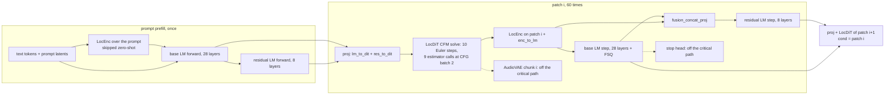

# Parallelisation on one RTX 5070 Ti: what overlap is left in VoxCPM2 (#136)

Research and design for [#136](https://github.com/kadirnar/kernel-agent/issues/136):
stream and stage overlap, persistent and warp-specialised kernels, SM partitioning,
and request pipelining, on one GPU. All numbers are **measured** on this machine (RTX 5070 Ti
16 GB, sm_120, 70 SMs, 48 MB L2, driver 615.71 / CUDA UMD 13.4, torch 2.14.1+cu130) on
`openbmb/VoxCPM2` with the built-in workload (60 patches, 10 timesteps, CFG 2.0, seed 0)
and the accepted sets of the runs in [VOXCPM2.md](VOXCPM2.md): latency
`runs/openbmb--VoxCPM2/20261005-192504` (FP8, 522 ms) and throughput
`runs/openbmb--VoxCPM2/20261006-004718-retest2` (batch 16, 6.03 ms per audio second),
applied through their exported `optimized/apply.py` to a freshly loaded model. Nothing in
the library changes here: the design (§6) and the plan (§7) are for review first, as the
issue asks.

## 0. Summary

* **The optimised model is GPU-bound and serial.** At batch 1 the GPU is busy 97.2 % of the
  run (524 of 540 ms; the host runs 77 ms ahead). Per patch the critical path is LocDiT
  solve → LocEnc → base LM step → residual LM step → projections → next LocDiT solve, and
  every edge is a data dependency. Off the critical path are only the AudioVAE decode
  (15.1 ms per run) and the stop head. CFG is already one batch-2 estimator call; "LocEnc vs
  the next LM step" is a dependency, not an opportunity.
* **Two stages on two streams buy 1–5 %**, because every optimised stage already spans the
  GPU (time-weighted SM fill 0.95–0.99; eager's LM step fills 0.36). Pairs of real stages
  (LocDiT ∥ VAE, LM ∥ VAE, LocDiT ∥ LM, LM ∥ LM) run 1.01–1.05× faster than the same work on
  one stream, hiding 4–10 % of the smaller job. Four back-to-back batch-1 requests with
  request *r*'s VAE on a second stream during request *r*+1: 2,090.5 → 2,086.8 ms (0.2 %).
* **Streaming the VAE does not pay as VoxCPM ships it.** Its stateful chunk decoder is
  host-bound (4.45 ms of host time per 160 ms chunk) and `AudioVAE.decode` builds `sr_cond`
  with a pageable host-to-device copy, which synchronises the stream: generation goes
  522 → 781 ms, on one stream *and* on a side stream. A graphed chunk decoder on a side
  stream would be worth ~2–3 ms of latency and a time to first audio of one patch.
* **The remaining latency is inside the stages.** Against the DRAM floor of their FP8
  weights (833 GB/s measured streaming rate) the LM step kernel runs at 80 %, the LocEnc at
  64 % and the fused LocDiT layer kernel `layer_coop<3>` at **44 %** (46.8 µs per layer,
  6,480 calls, 303 ms = 58 % of the run). The LocDiT layer at the LM kernel's 80 % is
  **~130 ms (522 → ~390 ms, 1.34×)**: kernel-level overlap of the weight stream with the
  layer's phases (warp specialisation, cross-phase and cross-layer prefetch), not streams.
* **PDL is the cheapest kernel-boundary overlap.** A 28-layer DRAM-bound GEMV chain (2 MB per
  layer) takes 231.6 µs as eager launches, 101.2 µs as one CUDA graph, **77.7 µs as a graph
  with programmatic dependent launch** (= the 76.7 µs DRAM floor) and 136.7 µs as one
  persistent cooperative kernel with a grid barrier per layer (~2.2–2.4 µs per barrier). A
  graph kernel boundary costs ~0.9 µs.
* **Multi-stream CUDA graphs work** (fork/join with `wait_stream` inside the capture): a
  DRAM-bound ∥ tensor-core branch pair 623 → 536 µs in one graph (1.16×), two DRAM-bound
  branches 609 → 556 µs (1.09×).
* **Green contexts** (`torch.cuda.GreenContext`, beta) work on this GeForce card in 8-SM
  steps, but two of them share SMs (disjoint partitions need one driver-API split), disjoint
  partitions lose to plain streams for throughput (GEMV chain ∥ VAE: 29.5 ms at best on
  38 + 32 SMs vs 25.8 ms unpartitioned; they buy isolation: the DRAM-bound job keeps its full
  speed), a CUDA graph replayed on a green-context stream is not confined to the partition,
  and the agents' cooperative kernels (grid sized from the device's 70 SMs, which
  `multiProcessorCount` still reports inside) are rejected inside one.
* **Throughput (batch 16)**: the batched loop's per-patch stop-flag `.cpu()` leaves the GPU
  idle; reading the flags asynchronously (identical latents) takes GPU busy 93.1 → 96.0 % and
  the run 937 → 923 ms (−1.5 %); each batch's VAE on a second stream during the next batch
  hides a third of the VAE (−0.7 %); both together −1.4 % over 3 runs. Continuous batching at
  natural length is worth up to 1.31× for the default 16 texts and nothing in the
  fixed-length benchmark.

Plan (§7), in order: timeline view in the profile → asynchronous stop check in the batched
loop → declared streams in the evaluator → PDL in the kernel toolkit → warp-specialised
LocDiT layer → graphed streaming / pipelined VAE → serialization points → green-context-aware
grids → continuous batching. Outlook on this GPU: latency 522 → ~370 ms
(~1.4×), almost all of it from PR 5; everything else in this issue is ≤ 1–5 % for one request.

## 1. Method

* **Stage ranges.** Every stage entrypoint of one generation is wrapped in a profiler range
  after the optimised set is applied (so the ranges wrap whatever the transforms installed):
  `feat_decoder.forward` (LocDiT CFM solve, 9 estimator calls), both LMs' `forward_step`
  (batch 1) or `workload.lm_step` (batch 16), `feat_encoder` per patch (LocEnc) and over
  the prompt, both LMs' prompt `forward`, `audio_vae.decode`, the projections
  (`lm_to_dit_proj`, `res_to_dit_proj`, `enc_to_lm_proj`, `fusion_concat_proj`, FSQ) and the
  stop head.
* **Trace.** One run under `torch.profiler` (CPU + CUDA activity), exported as a Kineto
  chrome trace. Every GPU event (kernel, memcpy, memset) is attributed to the innermost
  stage range around the CPU launch with its correlation id (a CUDA-graph replay's kernels
  carry the graph launch's id). Per stage: kernels, GPU time, SM fill (grid blocks / 70,
  capped at 1, time-weighted), CUPTI's estimated achieved occupancy, queue delay (GPU start −
  CPU launch: how far the host runs ahead). Per run: union GPU busy, idle, every gap between
  consecutive GPU work by size, by the stages around it and by the event before it. Per
  patch: medians over the steady patches (patch *i* starts at the *i*-th LocDiT launch).
* **Timing.** Unprofiled latencies are wall time with device synchronisation (as
  `workloads.base.timed_run`) after `bench.warm_gpu` (the GPU drops its memory clock when
  idle, #81). Microbenchmarks use CUDA events (median of 20–30) or, across green contexts,
  stream synchronisation.
* **Eager traces** cover 12 (batch 1) and 10 (batch 16) patches: eager VoxCPM2 launches
  ~8,500 kernels per patch and the profiler stretches a host-bound run (1,125 → 2,651 ms), so
  eager GPU busy is reported against the unprofiled wall time.
* Every GPU job ran under the shared GPU lock, < 10 min each. The scripts stay outside the
  repository (excerpts in the appendix); nothing was written into `runs/`.

## 2. The dependency graph of one generation



| edge | kind | can it overlap? |
|---|---|---|
| LocDiT estimator call *k* → *k*+1 (9 per patch; the first of 10 Euler steps is a zero init) | data (Euler state) | no; CFG's two branches are already one batch-2 call |
| LocDiT → LocEnc → base LM → residual LM → next LocDiT | data | no: each consumes the previous output |
| base LM step → stop head | data, off the path | the stop head (2 kernels, 14 µs) can run anywhere before the host reads the flag; `skip_dead_work` already defers the read at batch 1 |
| LocDiT patch *i* → AudioVAE chunk *i* | data, off the path | yes: streaming decode on a second stream (§4.2) |
| request *A* ↔ request *B* | none | yes: batching (weights read once) or streams (§4.1, §5) |
| prompt: LocEnc → base LM → residual LM | data | no (zero-shot skips the LocEnc) |
| host work (tokenizer, Python, launches) ↔ GPU | none | at batch 1 already (host 77 ms ahead); at batch 16 not (§3.3) |

Per request the critical path is the whole patch loop: there is no second chain of work to
put on another stream except the VAE. Overlap inside a request has to come from inside the
stages (§4.6), and across requests from batching or pipelining (§5).

## 3. Measured profiles

### 3.1 Batch 1 (latency)

| | eager (12 patches) | optimised (60 patches, accepted FP8 set) |
|---|---|---|
| run, unprofiled | 1,123–1,129 ms (5,407–5,476 ms at 60 patches) | 529–531 ms via `workload.run` (records latents), 522–524 ms via `_inference` + decode (§4.2); 522.3 ms accepted |
| GPU kernel time | 513 ms = 46 % of the unprofiled run | 524.4 ms = **97.2 %** of the 539.5 ms profiled window |
| kernels | 102,527 (8,544 per patch) | 28,439 (**474 per patch**) |
| host lead (median queue delay in the loop) | 6 µs (host-bound) | **77 ms** (GPU-bound) |
| streams | 1 | 1 |

Per steady patch (GPU µs; the optimised patch period is 8,430 µs start to start, 8,282 µs busy):

| stage | eager kernels | eager GPU µs | eager SM fill | opt. kernels | opt. GPU µs | opt. SM fill | FP8 DRAM floor µs | of floor |
|---|---|---|---|---|---|---|---|---|
| LocDiT solve (9 estimator calls) | 5,990 | 14,462 | 0.71 | 353 | 5,263 | 0.96 | 2,243 | **43 %** |
| base LM step (28 layers) | 1,438 | 19,881 | 0.36 | 38 | 1,990 | 0.99 | 1,586 | 80 % |
| residual LM step (8 layers) | 304 | 5,540 | 0.36 | 16 | 571 | 0.98 | 453 | 79 % |
| LocEnc (12 layers) | 578 | 1,557 | 0.53 | 26 | 392 | 0.95 | 249 | 64 % |
| projections, stop, other | 16 | 81 | | 12 | 64 | | | |
| **patch** | **8,326** | **41,521** | | **445** | **8,282** | | **4,531** | **55 %** |

The floor is the patch's FP8 weight bytes over 833 GB/s, the streaming read rate measured in
§4.6 (LM layer 47.19 M parameters, LocDiT / LocEnc layer 17.30 M; the LocDiT streams its 12
layers 9 times per patch: 1.87 GB). Eager's base LM step is 20 ms because it runs a masked
SDPA over the 8,192-slot static KV cache (round 2 in VOXCPM2.md).

Where the optimised run's GPU time goes: LocDiT 320.5 ms, of which `layer_coop<3>` (the agents'
fused FP8 decoder-layer kernel, cooperative, grid 140 = 2 blocks per SM) is 303.5 ms = 6,480
calls × 46.8 µs; base LM 119.1 ms (`layer_step_kernel<8>`: 1,652 × 71.6 µs, cooperative, grid
70); residual LM 34.8 ms; LocEnc 23.2 ms (`layer_coop<1>`: 708 × 31.0 µs); AudioVAE 15.1 ms;
prefill 7.3 ms (graphed); projections 3.5 ms. The LocDiT also launches 245 glue kernels per
patch beside its 108 layer kernels (Euler update, CFG combine, cat, time embedding): 14,576 of
its 21,180 kernels are under 5 µs but only 5 % of its time.

Idle time of the optimised run: 15.1 ms of 539.5 ms.

| gap | count | ms | what |
|---|---|---|---|
| < 2 µs | 27,998 | 6.10 | kernel boundaries inside graphs and streams |
| 2–10 µs | 1,097 | 2.65 | 572 of them between the LM step's per-layer cooperative launches (median 2.3 µs) |
| 10–500 µs | 23 | 1.62 | |
| > 500 µs | 3 | 3.20 | 1.31 ms in the graphed prefill (first device copy), 0.98 ms before the VAE (`sr_cond` is a pageable host-to-device copy: a stream sync), 0.91 ms for the final `.cpu()` of the audio |
| lead-in | | 1.53 | tokenizer and input tensors before the first GPU work |

### 3.2 Batch 16 (throughput)

| | eager (10 patches) | optimised (60 patches, accepted set) |
|---|---|---|
| run, unprofiled | 991–994 ms | 937–939 ms = 6.10 ms per audio second (6.03 accepted) |
| GPU kernel time | 548 ms = 55 % | 915.4 ms = **93.1 %** of the 983.2 ms window |
| kernels | 82,645 | 139,537 (**2,326 per patch**) |
| host lead (median queue delay in the loop) | 6 µs | 1.5–11.5 ms (synchronised every patch, §3.3) |

Per steady patch (GPU µs; optimised period 14,476 µs, busy 13,721 µs):

| stage | eager kernels | eager GPU µs | opt. kernels | opt. GPU µs | opt. SM fill | opt. est. occupancy |
|---|---|---|---|---|---|---|
| LocDiT solve (CFG batch 32, M = 352) | 5,655 | 32,829 | 1,632 | 9,780 | 0.97 | 9 % |
| base LM step (M = 16) | 1,441 | 6,591 | 398 | 2,522 | 0.92 | 44 % |
| residual LM step | 307 | 1,735 | 108 | 715 | 0.92 | 44 % |
| LocEnc (M = 80) | 579 | 1,930 | 136 | 602 | 0.91 | 10 % |
| projections, stop, other | 20 | 96 | 20 | 97 | | |

The optimised LocDiT is 67 % cuBLASLt FP8 GEMMs (`nvjet_sm120_qqtst`, 23,760 × 16.8 µs, 128
CTAs) and ~20 % glue (per-token quantisation 34 ms, RoPE attention 29 ms, norms 33 ms,
residual adds 11 ms per run). Against its FP8 compute floor (1.32 TFLOP per patch at the
338 TFLOP/s cuBLASLt reaches: 3.9 ms) it runs at 40 %; the base + residual LM steps reach 63 %
of their 2.0 ms DRAM floor. The AudioVAE (`vae_decoder__reduced`, 16 requests × 60 patches) is
52.4 ms per run (5.6 %).

### 3.3 Idle time at batch 16: the per-patch host sync

The optimised batch-16 run idles 67.8 ms (6.9 %). The workload's batched loop
(`VoxCPMBatchWorkload._generate_batch`) reads the stop flags with `logits.argmax(-1).cpu()`
once per patch after queuing the LocDiT and the LocEnc; the host waits for the GPU to drain,
then the GPU waits while the host issues the next LM step. In the trace (gap, then who
launched the next work):

| gaps | ms | median | between |
|---|---|---|---|
| 57 | 15.64 | 244 µs | graph input copy → base LM graph replay, host late |
| 57 | 8.39 | 139 µs | kernel → base LM step, host late |
| 61 | 7.19 | 33 µs | the stop flag's device-to-host copy → next work, host late |
| 311 | 5.24 | 12 µs | prompt prefill (eager at batch 16), host late |

At batch 1 the accepted `skip_dead_work` transform already reads the flag late; at batch 16
the loop is the workload's own code, which transforms do not replace. The same loop with the
flags computed at the top of the patch (they depend on `lm_hidden` only), copied to pinned
memory without blocking and read after the LocDiT and LocEnc are queued (appendix A.5):
**identical latents** (bit-exact, the loop is deterministic), GPU busy 93.1 → **96.0 %**, idle
67.8 → 37.6 ms, patch period 14.48 → 14.07 ms, run **937 → 923 ms (−1.5 %)**; −0.9 % over
three back-to-back runs with the VAE (§4.3). The profiled host-late gaps overstate the gain
(the profiler slows the host); what remains idle is the sub-2 µs kernel boundaries (18.8 ms).

## 4. Microbenchmarks

### 4.1 Two VoxCPM2 stages on two streams

The real stages of the optimised batch-1 model with their captured inputs, issued from one
host thread, interleaved, on one stream vs two streams. Alone (CUDA events, median of 20):
LocDiT solve 5.32 ms (host 0.12 ms: one graph replay), base LM step 2.05 ms (host 0.89 ms),
residual LM step 0.57 ms, LocEnc 0.53 ms, AudioVAE decode of 60 patches 14.41 ms (host
1.0 ms), one streaming VAE chunk 4.47 ms (host 4.45 ms).

| pair | one stream ms | two streams ms | speedup | share of the smaller job hidden |
|---|---|---|---|---|
| LocDiT ×10 ∥ VAE ×4 | 110.7 | 105.6 | 1.049 | 9.6 % |
| base LM ×20 ∥ VAE ×4 | 97.9 | 95.3 | 1.027 | 6.4 % |
| LocDiT ×10 ∥ base LM ×20 (two requests) | 93.0 | 91.2 | 1.019 | 4.3 % |
| LocDiT ×10 ∥ LocEnc ×20 | 60.4 | 59.8 | 1.011 | 6.1 % |
| base LM ×20 ∥ residual LM ×20 | 51.3 | 50.6 | 1.014 | 6.3 % |
| LocDiT ×10 ∥ VAE chunk ×10 (host-bound) | 97.6 | 59.3 | 1.648 | 86 % |
| base LM ×20 ∥ VAE chunk ×10 (host-bound) | 85.3 | 63.4 | 1.345 | 54 % |

Every GPU-bound optimised stage fills the GPU (grids of 70–140 co-resident blocks), so a
second stream only fills kernel-boundary bubbles; the block scheduler cannot preempt a
140-block cooperative layer kernel for a VAE convolution or the reverse. The large gains are
host-bound work (the eager streaming decoder) hiding behind GPU-bound work: host overlap, not
GPU overlap. Two requests' stages on two streams (1.019×) are no substitute for batching
them (batch 16 costs 1.7× one request per patch, §3).

### 4.2 Latency: the AudioVAE decode of finished patches on a second stream

End to end through `_inference` (the accepted loop) and the AudioVAE, best of 3:

| variant | ms |
|---|---|
| patch loop only (no VAE) | 506.9 |
| `generate` as VoxCPM does it: the loop, then the full decode | 522.0–522.9 |
| VoxCPM `generate_streaming`: chunk decode + `.cpu()` per patch on one stream | 781.5 |
| chunk decode per patch on a side stream, no per-chunk host sync | 781.6 |

The VAE tail is 15–16 ms. Streaming as shipped makes the run 50 % slower on either stream:
the stateful chunk decoder is eager (4.45 ms of host time for 4.47 ms of GPU work per chunk),
and `AudioVAE.decode` creates `sr_cond` with `torch.tensor([...], device=...)`, a pageable
host-to-device copy that synchronises the issuing stream; the side stream (which waits for
the main stream) drags the host back to the GPU every patch: 60 × (8.4 + 4.5) ms ≈ 774 ms.
A working version needs the chunk decoder captured in a CUDA graph (static causal-state
buffers, `sr_cond` made once) on a side stream. From §4.1 the VAE's GPU work still costs
~90 % of its time when it overlaps the loop, so the latency gain is ~2–3 ms (0.5 %); the time
to first audio (`-o metric=ttfa`) drops from the whole run to prefill + one patch + one chunk
(~20 ms).

### 4.3 Throughput: request-level pipelining

Batch 1: four different requests back to back (60 patches each), request *r*'s full VAE
decode issued on a second stream while request *r*+1 prefills and decodes: 2,090.5 /
2,092.1 ms sequential vs 2,086.8 / 2,088.5 ms pipelined, **0.2 %** (≈ 1 ms of each 15 ms VAE).

Batch 16: three batched runs back to back (16 × 60 patches each, 153.6 s of audio per run),
best of 2:

| variant | 3 runs ms | ms per audio second | vs as is |
|---|---|---|---|
| as the workload runs (VAE after the loop, `.cpu()`) | 2,787.1 | 6.048 | |
| batch *r*'s VAE on a second stream during batch *r*+1 | 2,766.9 | 6.005 | −0.7 % |
| asynchronous stop check (§3.3) | 2,761.4 | 5.993 | −0.9 % |
| both | 2,747.5 | **5.962** | **−1.4 %** |
| no VAE at all (bound) | 2,602.0 | 5.647 | −6.6 % |

The batched VAE costs 61.7 ms per run end to end (52.2 ms of GPU time alone); pipelined, a
third of it hides in the loop's idle gaps and boundary bubbles.

### 4.4 CUDA graphs with multi-stream capture

One graph holding two independent branches, captured on one stream vs forked
(`side.wait_stream(capture_stream)` … `capture_stream.wait_stream(side)` inside
`torch.cuda.graph`, appendix A.3). "mem": 28 × [2048 × 2048] bf16 GEMV chain (235 MB, DRAM
streaming, 318 µs alone); "compute": a bf16 GEMM chain at M = 352 (332 µs alone).

| branches | eager one stream | eager two streams | graph, serial | graph, forked | fork speedup |
|---|---|---|---|---|---|
| mem ∥ compute | 639.7 µs | 622.8 µs | 623.4 µs | **536.0 µs** | 1.16× |
| mem ∥ mem (other weights) | 625.0 µs | 614.7 µs | 608.8 µs | 556.0 µs | 1.09× |

Fork/join capture works with plain torch APIs, and a graph is where a fork pays: eager
two-stream issue is host-limited (+3 %), the forked graph hides 34 % of the smaller branch for
a memory-bound ∥ compute-bound pair. Two DRAM-bound branches still gain 9 % because one chain
alone does not saturate DRAM (309 µs vs the 282 µs floor, §4.6): each fills the other's
boundary bubbles. In VoxCPM2 the only independent branch inside a patch is the VAE chunk, so
this is the tool for §4.2 and for graphs over several requests.

### 4.5 Green contexts (SM partitioning)

`torch.cuda.GreenContext(num_sms=..., workqueue_scope=...)` (beta in torch 2.14; needs
`cuda.bindings` and a driver ≥ 12.8, workqueue configuration ≥ 13.1) works on this GeForce
card. `ctx.Stream()` returns an ordinary `torch.cuda.ExternalStream`; torch ops, cuBLAS,
cuDNN and Inductor/Triton kernels run on it, events recorded on it time it and join it to
primary-context streams, and `torch.cuda.synchronize()` waits for its work (3 of 3 trials with
~20 ms still queued), so `timed_run`'s bracket covers partitions.

Granted SMs per request (one partition): 1–8 → 8, 10–16 → 16, 24 → 24, 32 → 32, 35–40 → 40,
48 → 48, 56 → 56, 64 → 64, 68–70 → 70: **8-SM granularity**.

SM scaling, ms per call on a partition of *k* SMs (stream-synchronised wall, median of 10):

| SMs | 8 | 16 | 24 | 32 | 40 | 48 | 56 | 64 | 70 | plain stream |
|---|---|---|---|---|---|---|---|---|---|---|
| GEMV chain 28 × 8.4 MB (DRAM-bound) | 0.487 | 0.340 | 0.338 | 0.332 | 0.333 | 0.344 | 0.332 | 0.331 | 0.330 | 0.332 |
| AudioVAE decode, 60 patches (compute-bound) | 81.0 | 42.4 | 29.7 | 23.4 | 20.0 | 17.8 | 16.4 | 15.0 | 14.5 | 14.5 |
| LocDiT solve (a CUDA graph replay) | 5.36 | 5.34 | 5.35 | 5.35 | 5.36 | 5.36 | 5.35 | 5.35 | 5.36 | 5.35 |

* A DRAM-bound GEMV chain saturates DRAM with 16 SMs; the VAE scales almost linearly to 40.
* **A CUDA graph instantiated in the primary context and replayed on a green-context stream is
  not confined**: the graphed LocDiT solve takes 5.35 ms on every partition, although its
  140-block cooperative layer kernels cannot even launch in 8 SMs. Partitioning graphed work
  needs the capture itself on the green-context stream (not tested here).
* **Cooperative kernels sized by the device break.** `cudaDevAttrMultiProcessorCount` still
  reports 70 with the green context current; a cooperative launch of 70 × occupancy blocks
  fails with "too many blocks in cooperative launch" (the §4.6 persistent chain at maximum
  grid, and the accepted FP8 LM step kernel, at 16 and 40 SMs); sized to the partition
  (*k* blocks) it runs. The driver rejects rather than hangs.
* **Two torch `GreenContext`s are not disjoint partitions.** Each is split from the whole
  device (`cuDevSmResourceSplitByCount(1, device, 0, k)`), so two contexts of 32 SMs share
  SMs: the VAE on both at once took 46.4 ms against 29.4 ms on one. Disjoint partitions need
  one split into *k* SMs plus the remainder through `cuda.bindings` (wrapped here with
  `GreenContext._init_from_cuda_objects`, appendix A.4).
* **Disjoint partitions vs plain streams**, GEMV chain ×40 (12.3 ms alone) ∥ VAE (14.5 ms
  alone):

  | VAE SMs + GEMV SMs | VAE alone in its partition | GEMV ×40 alone in its partition | both at once |
  |---|---|---|---|
  | 8 + 62 | 81.1 ms | 12.3 ms | 88.4 ms |
  | 16 + 54 | 42.3 ms | 12.3 ms | 49.2 ms |
  | 24 + 46 | 29.7 ms | 12.6 ms | 36.4 ms |
  | 32 + 38 | 23.4 ms | 12.4 ms | 29.5 ms |
  | unpartitioned, two streams | 14.5 ms | 12.3 ms | **25.8 ms** |
  | unpartitioned, one stream | | | 26.7 ms |

  (An earlier run with two torch contexts, i.e. overlapping SMs, gave the same picture:
  34.2 ms for "46 + 24" and, with the graphed LocDiT solve instead of the GEMV chain, 71.3 ms
  for "54 + 16" against 44.9 ms on two plain streams.)

For throughput a partition never beats the block scheduler's sharing here: the confined job
runs at its partition's speed. What a partition does buy is isolation: the DRAM-bound chain
keeps its full speed on 38–62 SMs (12.3–12.6 ms vs 12.3 ms on 70) while the VAE runs beside it.
That is the shape of a streaming VAE beside the patch loop (the VAE's work for 60 patches takes
81 ms in 8 SMs, 42 ms in 16, against a 507 ms loop), but only once the loop's kernels are
DRAM-bound on fewer SMs and sized by the partition: today's cooperative LocDiT and LM kernels
are latency-bound (44–80 % of the DRAM floor) and refuse to launch in a partition.

### 4.6 Persistent kernel vs many launches for a decode GEMV chain

28 layers (the base LM's depth) of y = W x, W [H, H] bf16, distinct weights per layer (more
than the 48 MB L2: DRAM streaming), one warp per output row, weights loaded with
`ld.global.nc.L1::no_allocate`, fp32 accumulation (appendix A.2; all variants agree to
< 1.1 % of max |y| with a torch fp32 chain). The floor is one launch of the same GEMV over all
28·H rows: **833 GB/s** at H = 2048 (766 GB/s with 2 KB rows).

| variant | H = 1024 (2.1 MB per layer) | H = 2048 (8.4 MB per layer) |
|---|---|---|
| DRAM floor (one launch over all rows) | 76.7 µs | 282.1 µs |
| eager launches (one pybind call per layer) | 231.6 µs | 328.9 µs |
| eager launches with PDL | 228.4 µs | 303.2 µs |
| one CUDA graph | 101.2 µs | 309.0 µs |
| **one CUDA graph with PDL edges** | **77.7 µs (1.01× floor)** | **286.9 µs (1.02× floor)** |
| one persistent cooperative kernel, grid barrier per layer | 136.7 µs | 347.9 µs |
| same, next layer's row loaded into registers before the barrier | 141.9 µs | 372.6 µs |
| the same layer 28 times in a graph (L2-resident) | 48.7 µs | 99.6 µs |

* A graph boundary costs ~0.9 µs ((101.2 − 76.7) / 27, (309.0 − 282.1) / 27): drain, launch,
  ramp-up of the next grid. PDL (`cudaLaunchAttributeProgrammaticStreamSerialization`; the
  kernel issues its weight loads, `griddepcontrol.launch_dependents`, then
  `griddepcontrol.wait` before it reads x) hides all of it, also inside a graph.
* A hand-rolled grid barrier costs ~2.2–2.4 µs ((136.7 − 76.7) / 27, (347.9 − 282.1) / 27),
  and one persistent grid loses memory-level parallelism at the barriers; preloading the next
  row into registers before the barrier made it slower. The batch-1 layer kernels (`layer_coop`,
  `layer_step_kernel`) pay several grid syncs per layer each; the LM one still reaches 80 % of
  the DRAM floor because each phase streams megabytes between syncs.
* PDL is known to the agents (193 candidate and history files in the VoxCPM2 run directories,
  copies included): a batch-16 LocEnc candidate loads its weight slice into shared memory
  before `griddepcontrol.wait`, and the accepted batch-16 `dit_layer__fp8_w8a8` has PDL
  launches for its glue kernels, switched off ("no measured gain": the GEMMs between them are
  cuBLASLt calls, which do not take part). The batch-1 cooperative layer kernels launch
  without it, the knowledge files only link the CUDA guide, and the recorded lessons note it
  hurting on GEMM → GEMM edges when the wait came before the loads
  ([RESEARCH-TRITON.md](RESEARCH-TRITON.md): "noise or worse" in our CUDA kernels, ~0.3 µs in
  `dit_layer__fp8_w8a8`). The chain above is the case where it pays: many short memory-bound
  kernels whose prologue is the weight load.
* What the LocDiT layer (44 % of floor) needs is therefore not "one persistent kernel" but the
  weight stream decoupled from its phase structure: producer warps (or bulk / TMA copies)
  streaming the next phase's and the next layer's weights into a shared-memory ring while
  consumer warps compute and wait at the barriers (warp specialisation), plus PDL between the
  layer kernels so that layer *l*+1's first weights load during layer *l*'s tail. At the LM
  kernel's 80 % a LocDiT layer takes ~26 µs instead of 46.8 µs: 6,480 × 20.8 µs ≈ **130 ms
  per run**.

### 4.7 Stream-K / split-K for small M

From the recorded lessons of the VoxCPM2 sessions (read-only memory notes):

* M = 80 FP8 skinny GEMMs (LocEnc at batch 16): split-K with a last-block fixup cost more than
  it saved once the grid exceeded one wave (QKV split 2: 25 → 16 µs *without* the split). The
  fixup via fp32 `atomicAdd` (RED) into a persistent zeroed tile buffer that the last block
  reads and re-zeroes took the layer 0.955 → 0.810 ms; knock-outs showed ~10 µs of fixed
  per-launch cost per GEMM, with the weight stream and launches, not math, dominating.
* M = 352 FP8 (LocDiT at batch 16): manual split-K for N = 1024 via cuBLASLt batched-strided
  (batch 2, offset K/2): o_proj 9.8 → 8.9 µs, down 18.7 → 15.2 µs (layer 5.95× → 6.24×); a
  Triton 2-way split-K over 64 × 64 tiles 26.3 → 21.7 µs (3.6 % end to end). N = 2560 got
  slower. cuBLASLt's OUTER_VEC scale modes are not supported on sm_120.
* At M ≤ 22 (batch 1) the output has one row tile: a [22 × 1024] GEMM with 64-wide tiles puts
  16 CTAs on 70 SMs unless K is split; the agents' fused layer kernels split K across the whole
  co-resident grid instead (cooperative, 140 blocks).

Stream-K proper (a persistent grid walking a linearised MAC-loop space with fixups) is not
offered by cuBLASLt for FP8 on sm_120; CUTLASS has it for its sm90 kernels. With the fixed
costs above, its value here is load balance for odd tile counts at M = 352, not batch-1
decode, which is DRAM-bound.

## 5. Throughput: pipelining and continuous batching

* **Batching first.** One batch-16 patch costs 14.5 ms against 8.4 ms for one request (1.7×
  for 16×), because the weights are read once per step. Two requests on two streams instead
  gain 1.9 % (§4.1). Batch 32 would add rows to the compute-bound LocDiT (40 % of its FP8
  floor at M = 352) and keep the DRAM-bound LM steps nearly flat; its gain is a kernel
  question (#132, #133), not a parallelisation one.
* **Pipelining the VAE across batches** (batch *r*'s VAE ∥ batch *r*+1's prefill and loop):
  measured −0.7 % (§4.3); bound −6.6 % if the VAE were free. With the asynchronous stop check:
  −1.4 %. A partitioned VAE (§4.5) loses to plain streams.
* **Continuous batching.** The fixed-length benchmark (every request exactly 60 patches) gains
  nothing. At natural length a static batch runs until its longest request stops, computing
  finished slots (the batched loop keeps them). Natural length is roughly proportional to the
  text (NATURAL_TEXT: 81 characters, ~30 patches); the default 16 texts are 55–88 characters,
  mean / max = 0.76, so refilling freed slots with queued requests is worth up to **1.31×** for
  a stream of such requests, minus the newcomers' prefill (7.3 ms graphed at batch 1 per
  ~30 × 14.5 ms of decode: ~2 %), and it also cuts each request's latency to its own length.
  It needs a workload with a request queue, per-slot KV positions (the batched `lm_step`
  already takes a position per request) and per-request teacher forcing with slot reuse: a
  benchmark change to review before any code.

## 6. Library design: legitimate concurrency in kernel-agent

### 6.1 How streams are treated today

* **Module evaluator** (`kernels/evaluate.py`, `kernels/integrity.py`, `kernels/bench.py`):
  times with CUDA events on the current stream. Joined side streams are already allowed and
  timed (the end event follows the join): `activity_check` rejects GPU work launched from
  another thread (`foreign_threads`) and work still running when the timed stream moved on
  (`unjoined`, 2 µs slack), `wall_check` rejects GPU time the events miss (`hidden_ms`), and
  `Snapshot` rejects a changed `torch.cuda.current_stream()` or a patched `torch.cuda.Stream`.
  `tests/test_evaluator_exploits.py` keeps the `side_stream` and `background_thread` exploits
  rejected and asserts that a joined stream passes.
* **End to end** (transforms, integration A/B, held-out input, memoisation probe):
  `timed_run` brackets `workload.run` with a device-wide `synchronize()`, so every stream of
  the current device is timed. Nothing checks for threads or host callbacks that keep
  launching after `run()` returns, or for work on another device.
* **Agents** read "never hide work on side streams or threads" (`agent/program.md`) with no
  example of a correct fork/join, a multi-stream capture, the PDL idiom or partition-aware grid
  sizing (`knowledge/sources.md` only links the PDL guide). The accepted VoxCPM2 sets use one
  stream (side streams only for capture warm-up).
* **Profile** (`profiling/profiler.py`): `gpu_busy_ms` is the *sum* of kernel times from
  `key_averages`. With two streams overlapping the sum exceeds the wall time, and
  `kernel_problems` (busy > 105 % of the unprofiled run) marks the kernel view
  **unreliable**: legitimate concurrency reads as a broken profile. There is no per-stream
  view, no stage timeline and no idle-gap attribution, so the 31 ms of host-sync gaps per
  batch-16 run (§3.3) and the 15 ms VAE tail at batch 1 are invisible to the planner.

### 6.2 Proposed API: `kernel_agent/concurrency.py`

New, importable by candidates and transforms, CPU-testable with a fake stream:

```python
from kernel_agent import concurrency as cc

# fork/join: on entry the side stream waits for the caller's stream, on exit the caller's
# stream waits for the side stream. Capture-safe (inside torch.cuda.graph the fork and join
# become graph edges, §4.4). Tensors allocated on the side stream are record_stream'ed to the
# caller's stream so the caching allocator cannot hand their memory out early.
with cc.fork("vae") as side:  # a named, cached stream per (device, name)
    audio = decoder(latent)  # runs on `side`
# here the caller's stream already waits for `side`

# fire now, join later (pipelining across patches or requests). Every handle is joined before
# run() returns: the workload wrapper calls cc.join_all() and the evaluator asserts it.
handle = cc.launch("vae", decoder, latent)  # handle.result() joins and returns
...
cc.join_all()

# SM partitions (green contexts); None where unsupported (doctor says why). Disjoint by
# construction: one driver-API split into k SMs + the remainder (two torch GreenContexts
# overlap, §4.5); the remainder is what the caller's own kernels must then size for.
part, rest = cc.partition(sms=8)  # granted SMs: part.sms, rest.sms (8-SM steps)
with cc.fork("vae", partition=part):
    ...
# SMs of the current stream's partition: size grids (and cooperative launches) by this,
# not by the device's multiProcessorCount (70 even inside a partition)
n_sms = cc.sm_count()
```

and for CUDA C++ candidates a header in the kernel toolkit (`agent/examples/` +
`knowledge/cuda.md`):

```cpp
// cudaLaunchKernelEx with cudaLaunchAttributeProgrammaticStreamSerialization (and
// cudaLaunchAttributeCooperative when asked); falls back to <<<>>> where unsupported.
ka_launch(kernel, grid, block, smem, stream, {.pdl = true, .cooperative = false}, args...);
// device side: issue the loads that do not depend on the previous kernel, then
//   asm volatile("griddepcontrol.launch_dependents;"); asm volatile("griddepcontrol.wait;");
```

Why the checks stay: extra streams are a common published evaluator exploit (in 32.8 % of
CUDA-L1's solutions, 2.5 % of SOL-ExecBench submissions;
[RESEARCH-TRITON.md](RESEARCH-TRITON.md)). Rules the evaluator enforces (#7 kept, stated positively):

1. All GPU work of a call (module) or a run (end to end) is issued from the calling thread:
   `foreign_threads` stays a violation; `cc.launch` runs on the caller's thread.
2. Every stream is joined before the call or `run()` returns. Module level as today
   (`unjoined`, `wall_check`). End to end a new `e2e_activity` check, one profiled run per
   evaluation like `activity_check`: GPU work that starts after `run()` returned, work on
   another device, or a live thread running candidate code after `run()` is a
   `hidden_work` violation.
3. Streams are declared: `cc` records the named streams a candidate used; the result row
   carries `streams: ["vae"]`, the profile shows them and the planner can tell overlap from
   speed. A raw `torch.cuda.Stream()` stays legal when joined and is reported as
   `undeclared_streams` (a note, not a failure), so existing transforms (the capture warm-up
   streams of `hoist_cfm_invariants` and `graph_prefill`) keep working.
4. Timing stays as it is: wall time with every stream synchronised end to end, CUDA events on
   the caller's stream after the join at module level, `wall_check` beside them.

### 6.3 The profile's timeline: dependency graph and idle gaps

`profiling/timeline.py` (new; the prototype is `analyze.py`, appendix A.1):

* **Union busy**: `gpu_busy_ms` = the union of GPU event intervals across streams, with
  `kernel_time_ms` (the sum, today's number), `overlap_ms` (sum − union) and busy per stream.
  `kernel_problems` compares the union with the run, so overlapping streams are no longer
  "unreliable".
* **Stage ranges**: the module view already knows the entrypoints (`ModuleTimer`,
  `methods.py`); during the kernel profile it adds a `record_function("ka::<qualname>.<method>")`
  range per top-level stage call, and every GPU event goes to the innermost range of its
  launch (correlation id; a graph replay's kernels keep the replay's id). The kernel view must
  export the chrome trace to get grid sizes and occupancy (they are not in
  `kineto_results.events()` metadata).
* **Gaps**: every idle interval between consecutive GPU work, binned (< 2 µs, 2–10, 10–50,
  50–500, > 500 µs), attributed to the stage pair around it, to the event before it
  (device-to-host copy = host sync, pageable host-to-device copy, graph input copy) and to
  whether the next launch came after the GPU went idle (host late), with the host lead per
  stage. The planner's summary gets a short table, e.g. "idle 67.8 ms: 31 ms in 57 per-patch
  host syncs before the LM step (`stop.cpu()` in the batched loop)".
* **Dependency view**: from the module hooks, each top-level call's input and output storages
  (`untyped_storage().data_ptr()`) give producer → consumer edges between stage calls; with the
  measured GPU times that yields the critical path, the work off it, and "overlap potential =
  busy − critical path" per patch. For VoxCPM2 it reports VAE + stop head (2.9 %) at batch 1,
  which is what §4 measured.
* **SM fill and occupancy** per stage from the trace's `grid` and `est. achieved occupancy %`:
  a stage under ~50 % SM fill is a concurrency candidate (eager's LM step, 0.36); one at ~1.0
  is not (every optimised stage).

Files it would touch: `profiling/timeline.py` (new), `profiling/profiler.py` (`kernel_profile`
exports the trace and calls it; `kernel_problems` on the union; `summarize` prints the gap
table), `profiling/methods.py` (range names), `kernels/integrity.py` (an `e2e_activity` helper
sharing `_events`), `worker.py` (run it once per `e2e` / `e2e_ab` evaluation, a verdict like
the memoisation probe), `concurrency.py` (new), `agent/program.md` ("never hide work on side
streams or threads" → "launch from the calling thread, join every stream before you return,
declare streams with `kernel_agent.concurrency`"), `agent/knowledge/cuda.md` and `triton.md`
(fork/join, multi-stream capture, the PDL idiom, partition-aware grids), `agent/examples/`
(the §4.6 PDL GEMV chain with its selftest), `cli.py` `doctor` (green-context and PDL probe),
and tests: CPU (union / gap / attribution on synthetic event lists, `cc.fork` semantics with a
fake stream), GPU-marked (joined / unjoined / late-thread fixtures for `e2e_activity`, a
multi-stream graph capture).

## 7. Plan

### 7.1 Proposed PRs in priority order

Gains against today's measured runs: 522 ms latency; 6.05–6.10 ms per audio second at batch 16
(937 ms per batched run). Kernel work is listed with its measured headroom, not a promise.

| # | PR | kind | latency (522 ms) | throughput (batch 16) | why this order |
|---|---|---|---|---|---|
| 1 | Timeline view in the profile: union busy, per-stream busy, stage ranges, gap attribution, SM fill (§6.3) | library | 0 (enables the rest) | 0 | every decision below needs it; removes the false "unreliable" for overlapping streams |
| 2 | Asynchronous stop check in the batched VoxCPM loop (§3.3) | workload | 0 (batch 1 has it) | **−14 ms per run, −1.5 %** (measured, identical latents) | measured, small, independent |
| 3 | Declared concurrency: `kernel_agent.concurrency`, `e2e_activity` hidden-work check, prompt and knowledge (§6.2) | library + evaluator | 0 directly | 0 directly | makes 6 expressible and safe |
| 4 | PDL in the kernel toolkit: launch helper, idiom, verified example, doctor probe | library | −9…−24 ms (2–5 %): 8.8 ms of visible boundary gaps, ~0.9 µs × 474 boundaries per patch at most | −21…−119 ms (2–13 %): 20.8 ms visible, 2,326 boundaries per patch at most | measured: graph + PDL reaches the DRAM floor |
| 5 | Warp-specialised weight streaming for the fused LocDiT layer: cross-phase and cross-layer prefetch, PDL between layers (#134 stage 2, #133 for TMA) | kernel target | **−130 ms → ~390 ms (1.34×)** at the LM kernel's 80 % of DRAM | small (batch-16 LocDiT is GEMM-bound, #132) | the largest measured headroom |
| 6 | Graphed streaming VAE on a side stream; pipelined VAE across batched runs | transform (needs 3) | −2…−3 ms; time to first audio ~523 → ~20 ms | −0.7 % (measured) | only after 3 |
| 7 | Serialization points: `sr_cond` made once (no pageable copy), no `.cpu()` before the VAE, the prefill's first-copy gap | transform | −2…−3 ms | ≤ 3 ms (4 gaps > 0.5 ms, 7.4 ms, of which the final audio copy, 4.1 ms, stays) | cheap, below the 1 % bar alone |
| 8 | Green contexts in the toolkit: disjoint splits, partition-aware grids (`cc.sm_count()`), capture inside a partition | library | isolation only; at most the ~15 ms VAE tail, once the loop's kernels are DRAM-bound on 62 SMs (after 5) | not positive in any pair measured | only with 5 and 6 |
| 9 | Continuous batching workload (natural lengths, slot refill) | workload + objective | 0 | up to 1.31× at natural length for the default texts; 0 at fixed length | changes the benchmark: review first |

Outlook on this GPU: latency 522 → ~390 ms (PR 5) → ~370 ms (PRs 4 and 7), about 1.4×;
throughput 6.05 → ~5.9 ms per audio second from PRs 2, 4 and 6 at fixed length, more at natural
length with PR 9. Streams, partitions and pipelining are each ≤ 1 % for one request.

### 7.2 Proposed follow-up issues (not opened)

1. **Profile timeline: union GPU busy, per-stream view, stage ranges and idle-gap attribution.**
   `kernel_profile` sums kernel times, so overlapping streams exceed the wall time and the
   kernel view is marked unreliable. Add `profiling/timeline.py`: union and per-stream busy,
   stage ranges from the known entrypoints, gaps binned and attributed (host sync, pageable
   copy, graph launch, host late), host lead, SM fill and occupancy from the exported trace,
   and a producer → consumer critical path. Acceptance: the VoxCPM2 batch-16 profile shows the
   per-patch `stop.cpu()` syncs; a two-stream fixture is reliable.
2. **Batched VoxCPM loop: asynchronous stop check.** `_generate_batch` reads the stop flags with
   `.cpu()` once per patch and the GPU waits for the host's next launches. Compute the flags at
   the top of the patch (they depend on `lm_hidden` only), copy them to pinned memory without
   blocking and read them after the LocDiT and LocEnc are queued. Measured: identical latents,
   GPU busy 93.1 → 96.0 %, 937 → 923 ms. Re-measure the eager and compiled baselines (they
   benefit too) and say so in VOXCPM2.md.
3. **Declared concurrency for transforms and kernels.** `kernel_agent.concurrency` (`fork`,
   `launch` / `join_all`, `partition`, `sm_count`), named streams recorded in result rows, an
   end-to-end `e2e_activity` check (no GPU work after `run()` returns, no other thread or
   device), `program.md` reworded from "never side streams" to "join every stream, declare
   it", knowledge for fork/join and multi-stream capture. Exploit fixtures: an unjoined side
   stream and a late thread inside a transform are rejected; a joined, declared stream passes.
4. **PDL in the kernel toolkit.** A `ka_launch` helper (programmatic stream serialization,
   optionally cooperative), the device idiom (loads first, then `launch_dependents` / `wait`),
   a verified example (the 28-layer GEMV chain: graph 101.2 µs → graph + PDL 77.7 µs = DRAM
   floor) with a selftest, a `doctor` probe, and a note in `cuda.md` on where it hurt (waits
   placed before the loads). The planner should suggest it for graphed chains of
   memory-bound kernels.
5. **Warp-specialised weight streaming for the fused LocDiT decoder layer.** `layer_coop<3>`
   runs at 44 % of its FP8 DRAM floor (46.8 vs 20.8 µs per layer, 58 % of the batch-1 run)
   while the LM step kernel reaches 80 %. A kernel target whose approach is fixed: producer
   warps / bulk copies stream the next phase's and next layer's weights into a shared-memory
   ring across the grid syncs, PDL between layer launches. Expected −130 ms. Links #134
   (stage 2) and #133 (CuTe / TMA on sm_120).
6. **Streaming AudioVAE in a CUDA graph on a side stream; pipelined VAE across batches.**
   VoxCPM's streaming decoder is eager (4.45 ms host per chunk) and `decode` makes `sr_cond`
   with a pageable copy that synchronises the stream, so streaming costs 781 vs 522 ms. Capture
   the chunk decoder with static causal-state buffers, run it on a declared side stream (needs
   3); time to first audio from the whole run to ~20 ms. At batch 16 pipeline batch *r*'s VAE
   behind batch *r*+1 (measured −0.7 %).
7. **Green-context partitions: partition-aware kernels and a doctor probe.** `GreenContext`
   works on sm_120 in 8-SM steps, but two torch contexts share SMs (disjoint partitions need
   one driver split), `multiProcessorCount` still reports 70 inside one, device-sized
   cooperative launches are rejected, and graph replays ignore the partition. Provide
   `cc.partition` / `cc.sm_count()`, require partition-sized grids in the toolkit, capture
   graphs inside the partition, and only then measure the streaming VAE in 8 SMs beside the
   loop (measured pairs: partitions lose to plain streams for throughput, keep the DRAM-bound
   job at full speed).
8. **Continuous batching workload for VoxCPM2.** A request queue, slot refill when a request
   stops, per-slot KV positions (the batched `lm_step` already takes one per request), per-request
   teacher forcing with slot reuse and per-request latency in `metric_detail`. Worth up to 1.31×
   for the default texts at natural length (mean / max 0.76), nothing at fixed length: decide the
   benchmark definition first.


## Appendix: script excerpts

The scripts, as run, are in [`docs/research-scripts/parallel-voxcpm2/`](research-scripts/parallel-voxcpm2/): `common.py` (load, apply the
optimised set, stage ranges, profiled run), `analyze.py` (attribution and tables),
`prof.py` (driver), `bench_streams.py` (§4.1–4.3, batch 1), `bench_b16_pipeline.py` (§3.3,
§4.3), `bench_graph_ms.py` (§4.4), `bench_green.py`, `bench_green2.py`, `green_sync.py` and
`coop_green.py` (§4.5), `gemv_ext.py` + `bench_persistent.py` (§4.6).

### A.1 Stage ranges and attribution

```python
def _wrap(obj, attr, label):  # instance-level, after the optimised set is applied
    inner = getattr(obj, attr)

    def wrapped(*args, **kwargs):
        name = label(args, kwargs) if callable(label) else label
        with record_function(f"stage::{name}"):
            return inner(*args, **kwargs)

    setattr(obj, attr, wrapped)


_wrap(m.feat_decoder, "forward", "dit")
_wrap(m.base_lm, "forward_step", "lm.base")  # batch 16: wrap workload.lm_step instead
...
# analysis: CPU ranges -> non-overlapping innermost segments; every GPU event is attributed
# through its correlation id to the CPU launch (a graph replay's kernels carry its id)
segs = flatten(annotations)  # [(start, end, innermost label)]
launch = {e.corr: e.start for e in api_events}  # cudaLaunchKernel, cudaGraphLaunch, ...
stage = segs[bisect_right(seg_starts, launch[gpu_event.corr]) - 1][2]
```

### A.2 GEMV chain kernel with PDL

```cpp
template <int KI, bool PDL>
__global__ void __launch_bounds__(256) gemv_kernel(const bf16* W, const bf16* x, bf16* y, int N) {
  const int lane = threadIdx.x & 31, row = (blockIdx.x * blockDim.x + threadIdx.x) >> 5;
  uint4 w[KI];
  if (row < N) load_row<KI>(W + (size_t)row * KI * 256, lane, w);   // weights: independent
  if (PDL) {
    asm volatile("griddepcontrol.launch_dependents;" ::: "memory");
    asm volatile("griddepcontrol.wait;" ::: "memory");             // x: written by the previous grid
  }
  if (row >= N) return;
  float acc = dot_row<KI>(w, x, lane);                               // fp32 FMA + warp reduce
  if (lane == 0) y[row] = __float2bfloat16(acc);
}
// launch: cudaLaunchKernelEx with cudaLaunchAttributeProgrammaticStreamSerialization = 1;
// captured into a torch.cuda.CUDAGraph the programmatic edges are kept.
```

### A.3 Multi-stream capture

```python
g = torch.cuda.CUDAGraph()
with torch.cuda.graph(g):
    cur = torch.cuda.current_stream()
    side.wait_stream(cur)  # fork
    mem_chain()  # branch 1 on the capture stream
    with torch.cuda.stream(side):
        compute_chain()  # branch 2
    cur.wait_stream(side)  # join
g.replay()
```

### A.4 Green contexts: disjoint partitions

```python
from torch.cuda._utils import _check_cuda_bindings as chk, _cuda_bindings_driver as drv
from torch.cuda.green_contexts import GreenContext


def wrap(resource):  # a torch GreenContext around a driver-API partition
    dev = chk(drv.cuDeviceGet(0))
    desc = chk(drv.cuDevResourceGenerateDesc([resource], 1))
    g = chk(drv.cuGreenCtxCreate(desc, dev, drv.CUgreenCtxCreate_flags.CU_GREEN_CTX_DEFAULT_STREAM))
    gc = GreenContext.__new__(GreenContext)
    gc._init_from_cuda_objects(0, g, chk(drv.cuCtxFromGreenCtx(g)))
    return gc


sm = chk(
    drv.cuDeviceGetDevResource(
        chk(drv.cuDeviceGet(0)), drv.CUdevResourceType.CU_DEV_RESOURCE_TYPE_SM
    )
)
groups, _, rest = chk(drv.cuDevSmResourceSplitByCount(1, sm, 0, 16))  # 16 SMs + the other 54
vae_ctx, loop_ctx = wrap(groups[0]), wrap(rest)
s = vae_ctx.Stream()  # torch.cuda.ExternalStream
with torch.cuda.stream(s):
    audio = model.audio_vae.decode(z)
s.synchronize()  # torch.cuda.synchronize() and events cover it too
```

### A.5 Asynchronous stop check (the batched loop, changed lines)

```python
_stop_host = torch.empty(batch, dtype=torch.int64).pin_memory()
_ready = torch.cuda.Event()
for i in range(n):
    _logits = model.stop_head(model.stop_actn(model.stop_proj(lm_hidden)))
    _stop_host.copy_(_logits.argmax(dim=-1), non_blocking=True)
    _ready.record()
    ...  # LocDiT, LocEnc queued as before
    logits = _logits
    _ready.synchronize()  # was: stop = logits.argmax(dim=-1).cpu()
    stop = _stop_host.clone()
```
