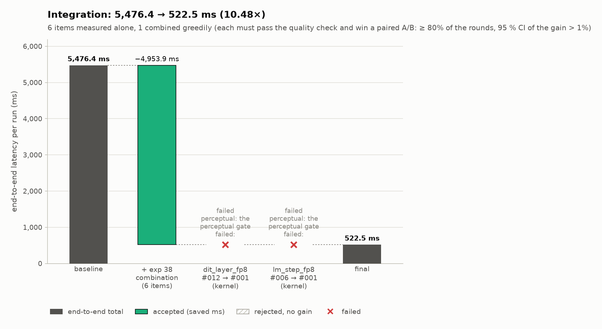
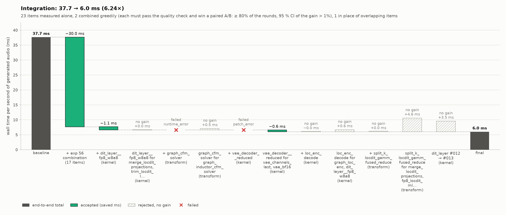
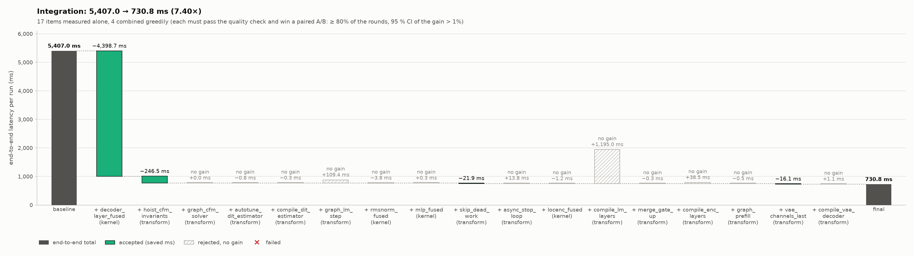
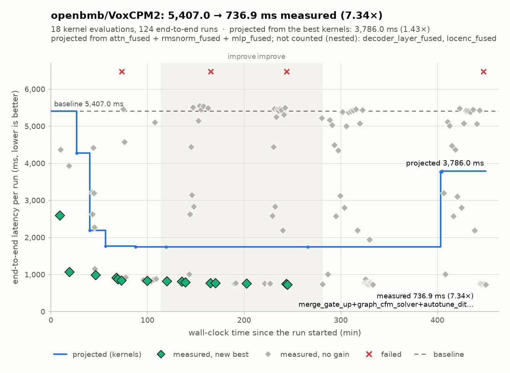

# VoxCPM2 on an RTX 5070 Ti: 10.5× lower latency, 6.2× higher throughput with kernel-agent

The motivating case for the roadmap ([ROADMAP.md](ROADMAP.md), tracking issue
[#24](https://github.com/kadirnar/kernel-agent/issues/24)): make
`openbmb/VoxCPM2` (voxcpm 2.0.3, bf16) fast on one RTX 5070 Ti (16 GB, sm_120,
torch 2.14.1+cu130) with the continuous `kernel-agent improve` loop.

## Round 2 result (bf16, exact)

Benchmark workload (built-in VoxCPM workload: 60 patches = 9.6 s of 48 kHz
audio, 10 flow-matching steps, CFG 2.0, seed 0):

| configuration | latency per run | vs eager | vs VoxCPM's own `torch.compile` |
|---|---|---|---|
| eager PyTorch (`optimize=False`) | 5,407 ms | 1.00× | 0.70× |
| VoxCPM `optimize()` (`torch.compile`, reduce-overhead) | 3,798 ms | 1.42× | 1.00× |
| kernel-agent, round 1 (integrated) | 891 ms | 6.07× | 4.26× |
| **kernel-agent, final (paired A/B integration)** | **731–737 ms** | **7.34–7.40×** | **5.15–5.20×** |

Real use through VoxCPM2's own `generate()` at natural length
(`examples/voxcpm2_optimized.py`, three English sentences, the exported
`optimized/` package applied to a freshly loaded model):

| | total time | real-time factor | Whisper-large-v3 WER |
|---|---|---|---|
| eager | 8.44 s | 0.57 | 0.08 / 0.00 / 0.00 |
| optimised | 1.13–1.15 s | 0.077–0.080 | 0.08 / 0.00 / 0.00 |

(The 0.08 is Whisper spelling "optimisation" as "optimization".) Audio lengths
match (4.6–5.0 s per sentence).

Cost: 19 agent sessions, **$31.67** of Claude usage, 4 h 41 min wall clock
(two `improve` rounds), 113 ledger rows.


## Round 3: FP8 weights, near-lossless (10.48×)

After round 2 the integrated model was GPU-bound at ~92–95 % of the **bf16**
memory-bandwidth floor (LM decode streams 3.4 GB of weights per patch, the
LocDiT 0.5 GB per estimator call). Round 3 changed the rules instead of the
kernels' tiling: `--quality near-lossless` (#71) allows FP8 e4m3 weight-only
storage (#72) when a perceptual gate (Whisper-large-v3 WER, WavLM speaker
similarity, UTMOS) on voice-cloned held-out sentences stays within the noise of
eager, plus a teacher-forcing sanity floor. All agent sessions ran on the
Claude Code subscription (`--auth subscription`, #70).

| configuration | latency per run | vs eager | vs VoxCPM `torch.compile` |
|---|---|---|---|
| eager | 5,476 ms | 1.00× | 0.69× |
| VoxCPM `optimize()` | 3,760 ms | 1.46× | 1.00× |
| round 2 (bf16, exact) | 731 ms | 7.49× | 5.14× |
| **round 3 (FP8 weights, near-lossless)** | **522.5 ms** | **10.48×** | **7.20×** |

Real use through `generate()` at natural length (`examples/voxcpm2_optimized.py`):
8.54 s → 1.01 s for three sentences (**8.5×**, RTF 0.57 → 0.06–0.09), identical
Whisper WER. FP8 shifts the natural stop by a patch on some sentences (4.48–4.80 s
of audio vs 4.96 s), which the near-lossless stop check allows.

Accepted: the agents' FP8 fused decoder-layer kernels for the LocDiT/LocEnc path
(`dit_layer_fp8`, module 12.2×) and the LM decode step (`lm_step_fp8`, 10.5×),
plus the hoisted + CUDA-graphed CFM solver, dead-work removal, channels-last VAE
and a graphed prefill. The integration also tried swapping each FP8 kernel back
to the round-2 bf16 prior; both swaps failed the perceptual gate and the FP8
versions stayed.

Issues found and fixed during this round: the GPU drops its memory clock after
about a second idle, which made bandwidth-bound kernels time up to 12× slower
in-process (#81, every timing round now waits for full clocks); a recheck cache
reused measurements from before that fix (#83); and integration never tried newer
versions of kernels already in the seed combination (#84, 731 → 522.5 ms once
fixed). Still open: the round-2 re-profile of the FP8-optimised model fails
(#86), so this run stopped after one round.



## Throughput: 16 requests at once (6.24×)

The batched workload (`-o batch_size=16 -o metric=throughput`): 16 different
texts generated together, 60 patches each (153.6 s of audio per batched run),
every request checked against VoxCPM2's own batch-1 generation (teacher
forcing per request) and the near-lossless perceptual gate. The metric is wall
time per second of generated audio (lower is better). All agent sessions ran
on the Claude Code subscription.

| configuration | ms per second of audio | seconds of audio per second | vs eager batch 16 | vs `torch.compile` |
|---|---|---|---|---|
| eager, batch 16 | 37.66 | 26.6 | 1.00× | 0.50× |
| VoxCPM `optimize()` (`torch.compile`) on the batched decode step | 18.98 | 52.7 | 1.98× | 1.00× |
| round 1 (transforms only) | 7.69 | 130 | 4.90× | 2.47× |
| round 2, re-integrated with #112 and #115 | 7.25 | 138 | 5.20× | 2.62× |
| **round 3** | **6.03** | **166** | **6.24×** | **3.15×** |

For scale: a single eager request makes 9.6 s of audio in 5,476 ms (1.75 s of
audio per second, the latency table above), so the batched, optimised model
produces about 95× as much audio per second. Every final set passed the gate:
error rate +0.000, speaker similarity 0.990–0.991 (worst sample ≥ 0.967),
no MOS drop.



What the final set is (each step a paired A/B on top of the previous set):

* **Transforms (round 1, the systems agent):** the LocDiT's 9 Euler steps per
  patch in one CUDA graph around an Inductor-fused estimator; graphed batched
  LM decode step (`workload.lm_step`) and LocEnc; merged LocDiT projections;
  a fused LM decode step; the LocDiT's last layer only on the rows the
  estimator reads; FP8 weight-only LM GEMMs; **W8A8 FP8 GEMMs for the LocDiT**
  (e4m3 weights per channel and activations per token, a shape-tuned Triton
  e4m3 GEMM at M = 352, split-K); a single-tile Triton attention for the
  ≤ 16-token patches. Together 37.66 → 7.66 ms.
* **`dit_layer__fp8_w8a8` (kernel, round 3):** the LocDiT decoder layer in W8A8
  FP8 on the tensor cores (module 6.24×), −14.3 % on top of the transforms.
* **`vae_decoder__reduced` (kernel, round 3):** the AudioVAE decoder in bf16
  (module 9.64×), in place of the two VAE transforms, −8.5 %.

How the library got there, and what this run made it fix:

* **Round 1** found the LocDiT compute bound at M = 352 only because the
  analysis was pasted into `program.md` by hand. The ceilings table (#90,
  #106) now computes it: with the hand analysis removed, the round-2 planner
  moved the stuck exact `dit_layer` target to `fp8_w8a8` on its own (#91, #96),
  with the table's numbers as its reason (79 TFLOP per run at M = 352, compute
  bound, a 792 ms floor in bf16 against 240 ms in W8A8).
* **Round 2's kernels never reached the result** (4.87×): adding them to the
  composite ran out of GPU memory in the in-process A/B, and a VAE kernel
  clashed with the VAE transforms. #112 retries out-of-memory steps in
  separate processes and tries a kernel *in place of* the transforms that own
  its module.
* **A kernel that read out of bounds was accepted** (VAE kernel 004, masked
  stores on a partial last tile): #115 runs every kernel under
  `compute-sanitizer` memcheck, on its captured shapes and on one-smaller
  ones, before it is accepted; 004 was refused with 23,808 errors and the
  round-3 kernel 008 replaced it.
* **The first W8A8 kernels were refused although correct**: the perturbed-input
  check had never been calibrated for reduced precision; #109 calibrated it per
  precision (the reference W8A8 math itself failed 98 of 200 redrawn draws).
* **Faster loops:** integration measurements are reused by content (#93; #108
  migrates files from before it): 29 of 33 steps reused in the round-2
  re-integration, 16 min instead of 2 h;
  the final integration's time is reserved and capped (#100, #108), and the
  first Ctrl-C stops a run and its processes (#94).

Run directories: `runs/openbmb--VoxCPM2/20261006-004718` (rounds 1–2) and its
copy `20261006-004718-retest2` (re-integration with the fixes, round 3).


## Round 2: what made it fast

The range comes from two independent final integrations with the current
code: the first accepted four items (below, 730.8 ms); the second, after the
stale kernel records had been re-evaluated (#58), seeded from the best measured
combination of 14 items plus the hoisted CFM solver (736.9 ms). Both use the
same fused decoder-layer kernel for most of the gain; they differ by < 1 %.
Real use was measured with each exported package (7.49× and 7.35×).

The first final integration (paired in-process A/B, each step ≥ 80 % of 8
rounds won and a bootstrap 95 % CI of the gain > 1 %) accepted four items:

| item | kind | what it does | gain when added |
|---|---|---|---|
| `decoder_layer_fused` | CUDA C++ kernel (agent-written) | the whole MiniCPM decoder layer's `forward_step` as one cooperative kernel per layer with 4 grid syncs: RMSNorm, QKV GEMV, RoPE + KV-cache write + split-KV attention over the valid positions only, o-proj + residual, RMSNorm, gate/up GEMV with SiLU, down-proj + residual; bf16 rounding after each op like the reference; 97 % of the speed of light at module level | −4,399 ms |
| `hoist_cfm_invariants` | transform | moves loop-invariant work out of the flow-matching Euler solver and captures the solver as a CUDA graph | −247 ms |
| `skip_dead_work` | transform | skips work whose results are never used (LM step after the last patch, stop head before `min_len`, LocEnc over an all-zero prefill mask — checked at run time) | −22 ms |
| `vae_channels_last` | transform | AudioVAE decoder in a channels-last layout (no cuDNN layout transposes), `weight_norm` folded once instead of every decode, depthwise causal convs + Snake as fused stencils | −16 ms |

The decisive insight came from the profile kernel-agent produced once
`forward_step` entrypoints were visible (#1): 45 % of the eager run's GPU time
was a masked SDPA over the whole 8,192-slot static KV cache while ~70 slots
were valid, and the run was launch-bound (47 % GPU busy, 507k launches).





## What the roadmap work caught along the way

* **Every correct kernel was rejected at first.** Free-running TTS output is
  chaotic under bf16 rounding changes (the bundled Triton RMSNorm scored
  spectral cosine 0.69 against a 0.97 gate). Teacher-forced validation (#2)
  fixed that; a natural-length run now also checks the stop condition (#55).
* **The decode path was invisible** to module hooks (`forward_step`, #1). The
  same work found that the side-effect check missed KV-cache writes entirely.
* **Integration bugs found on this run**: the systems arm's gains on top of
  kernels were not credited (#40) and transforms evaluated only with kernels
  never reached integration (#43; 929 → 847 ms once fixed). Noisy single
  measurements were replaced by paired A/B (#11).
* **The evaluator was gameable** (12 of 18 known exploit classes in v0.1.0);
  #5–#8 close them, and a memoising transform that would have reported
  285,656× is now rejected. Re-checking the winners with the hardened
  evaluator showed the attention kernel's module speedup is 18.8×, not the
  46.9× the old evaluator recorded. Stale records are now re-evaluated by the
  current evaluator before the re-check (#58): the attention kernel's record is
  18.3×.

## Reproduce

```bash
uv sync --extra all --extra voxcpm
uv pip install --no-deps "voxcpm>=2.0.3"
uv pip install --no-deps torchaudio --index-url https://download.pytorch.org/whl/cu130
uv run --no-sync kernel-agent improve openbmb/VoxCPM2 --max-hours 6 --max-usd 40 \
    --slice 4 --agent-minutes 60 --rounds 2 --speedup-goal 4
uv run --no-sync kernel-agent watch runs/openbmb--VoxCPM2/<run>      # live dashboard
uv run --no-sync python examples/voxcpm2_optimized.py runs/openbmb--VoxCPM2/<run>/optimized
```

Results depend on the GPU, driver and torch version; the agents' kernels are
written for the GPU they run on.
